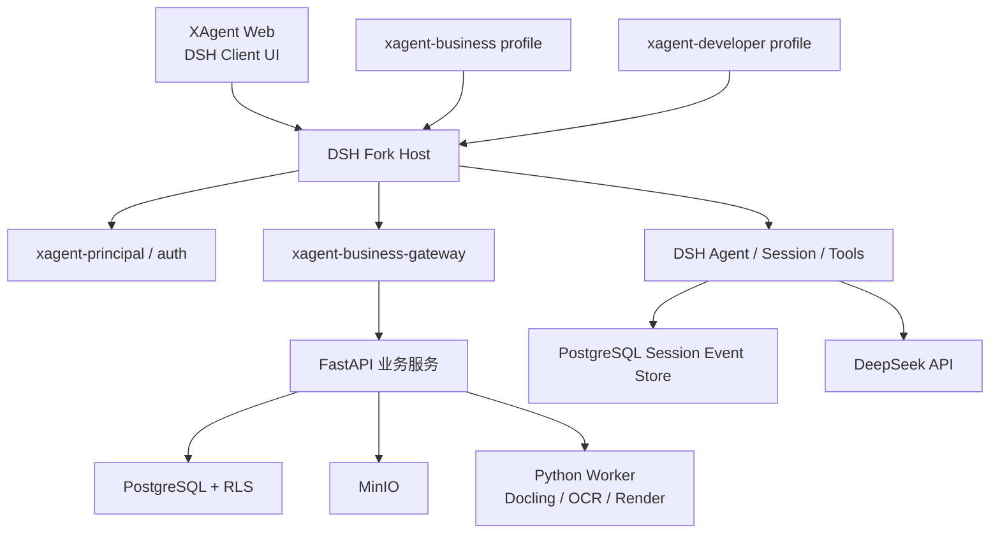
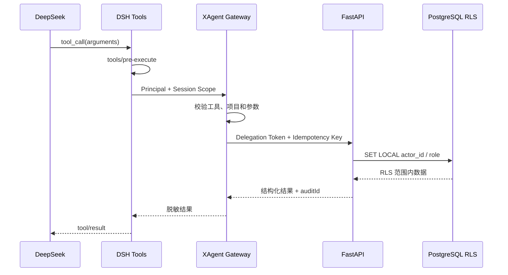
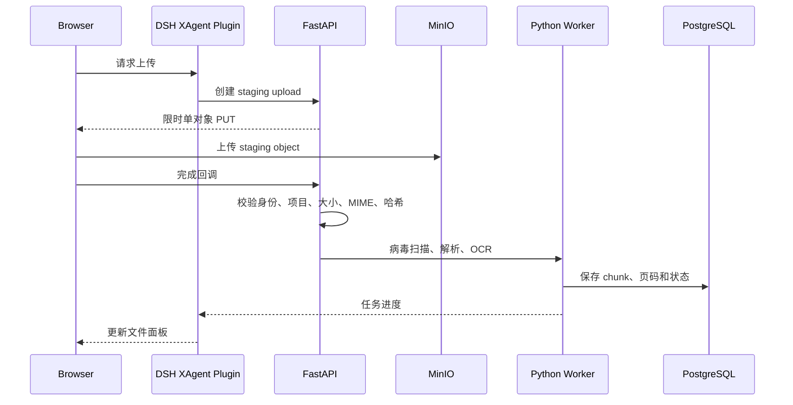
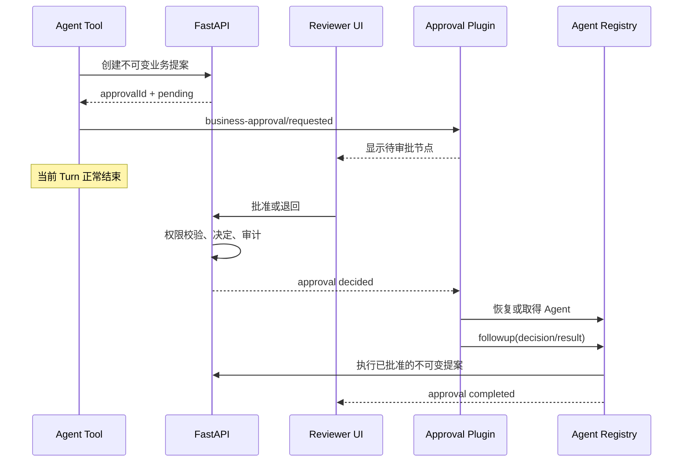

# XAgent 与 DeepSeek Harness Fork 融合技术设计

**状态：已确认，作为新仓库架构输入**

**日期：2026-08-20**

**范围：DSH Fork、分阶段迁移、双 Profile、业务插件体系**

## 1. 背景与决策

XAgent 当前由 React/Vite 前端、FastAPI 后端、PostgreSQL RLS、MinIO 和异步文档处理能力组成。产品目标是面向内部专员与管理层提供项目、资料、事实、文档、审批和受治理业务 Skill，同时具备可恢复、可追溯的 Agent 交互。

DeepSeek Harness（下文简称 DSH）提供基于 Cordis 的插件运行时、Agent Loop、模型与工具管线、Session event log、上下文压缩、Web 客户端插件和三栏 UI。它能显著降低通用 Agent Runtime 与对话 UI 的重复建设，但原生产品面向单用户或受信任主机环境，不具备 XAgent 所需的多账号认证、项目隔离、业务审批和业务数据模型。

本设计确认以下决策：

1. 新项目直接 Fork DSH，并允许修改其源码。
2. 保持 Cordis 的插件化原则；能通过插件完成的业务能力不写入 Agent Loop。
3. 采用分阶段迁移：第一阶段保留现有 FastAPI 业务服务，DSH Fork 承担 Agent Runtime 与 Web；稳定后再逐个迁移适合 TypeScript/Cordis 的模块。
4. 保留两个隔离 Profile：`xagent-business` 面向业务用户，`xagent-developer` 面向开发和系统维护。
5. Python 长期保留 Docling、OCR、Office 文档处理、Embedding 等适合 Python 生态的 worker。
6. FastAPI 与 PostgreSQL RLS 在第一阶段继续作为项目、文件、事实、审批、权限和正式审计的权威。
7. DSH Session log 是 Agent 运行与回放的权威，不替代正式业务数据和审计。

本设计取代 `2026-08-19-dsh-agent-runtime-spike.md` 中“以独立上游依赖接入 DSH”的候选方向。

## 2. 目标与非目标

### 2.1 目标

- 复用 DSH 的 Agent Loop、模型流、工具管线、Session、压缩、插件加载和 Web UI。
- 在 DSH Host、Connection 和 Session API 中实现多账号认证与项目级访问隔离。
- 把 XAgent 的业务能力组织成 Cordis Service Definition、Provider、Consumer 和客户端插件。
- 保留当前已经实现并测试的 JWT、RLS、项目、Artifact、MinIO 和 Audit 能力。
- 完成项目资料到事实、文档草稿、审批和导出的可追溯闭环。
- 建立可升级、可裁剪、能继续吸收 DSH 上游修复的 Fork 治理方式。

### 2.2 非目标

- 第一阶段不把全部 Python 代码重写成 TypeScript。
- 不把 DSH 原生工具审批当作业务审批。
- 不把 DSH Workspace 直接改名后当作 XAgent Project。
- 不允许业务 Agent 直接访问数据库、MinIO、服务器文件路径或任意网络地址。
- 不在业务 Profile 中提供 Coding Agent 的通用高权限工具。
- 不在建立 Profile 闭包和依赖验证前大规模删除 DSH 源码。

## 3. DSH 能力盘点

### 3.1 可直接复用

| DSH 能力 | 复用方式 |
|---|---|
| Cordis、Loader、Include、Timer、HMR | 插件生命周期、配置组合和开发热更新 |
| `core/agent`、`core/agent-loop` | Agent 注册、Turn/Step、模型和工具循环 |
| `core/tools`、`core/system-prompt`、`core/scope` | 工具管线、Prompt 组装和 Agent 隔离作用域 |
| `llm`、DeepSeek provider、retry | DeepSeek 流式请求、路由和失败重试 |
| Session persistence/projection contracts | Session event 存储、投影、恢复和客户端回放 |
| Compaction、Guard | 上下文压缩、工具超时和循环卫生 |
| Settings、Credentials | 运行配置和密钥引用接口 |
| Client modules、runtime、UI slots | 浏览器插件加载和 UI 组合 |
| UI conversation、tool、theme、primitives | 流式对话、工具卡片和基础视觉体系 |
| Jobs | 后台任务通用生命周期 |
| User Questions | Agent 向用户补充提问 |

### 3.2 已有但必须改造

| 模块 | 原有限制 | XAgent 改造 |
|---|---|---|
| Client Connection | Host/Origin 信任围栏，不是身份认证 | Cookie/JWT、HTTP/WebSocket Principal、断连和撤权 |
| API Remotes / API Proxy | Session 解析按运行时身份，不按业务用户 | 对 list/open/resume/search/fork/subscribe 统一授权 |
| Session | 没有用户、项目与可见范围 | 增加或关联 owner、project、visibility、permission revision |
| Session Persistence | JSONL/SQLite | 新增 PostgreSQL provider 与授权索引 |
| Workspace | 表示代码目录与 Session 分组 | 业务 Profile 中由独立 Project 插件替代 |
| Attachment | 简单不可变附件和本地存储 | 增加 MinIO、项目范围、版本和授权 provider |
| Permission Presets | 控制 Agent 工具权限 | 仅作为工具权限，不替代 RBAC/RLS |
| User Approval | 当前 Turn 内一次性工具授权 | 保留工具授权，业务审批另建持久状态机 |
| Skill | 文件形式的 Agent 指令 | 开发 Skill 保留；业务 Skill 另建生命周期 |
| Workflow | 模型生成脚本，worker thread 不是安全边界 | 仅开发 Profile 使用；业务流程采用声明式执行器 |
| UI Layout | 通用三栏 Agent 界面 | 保留 slot，改品牌、内容、宽度和移动端行为 |
| UI Sidebar / Workspace | 工作区和会话导航 | 项目、项目会话、待办和筛选 |
| UI Conversation | 通用消息和工具节点 | 引用、事实、文档、审批和任务节点 |
| UI Deliverables | 通用文件产物 | 资料、文档版本和导出产物 |
| Telemetry | 通用 Agent 运行信息 | 敏感字段脱敏与业务审计关联 |

### 3.3 仅 Developer Profile 保留

- Bash 与 PowerShell；
- 本地文件系统、源码搜索和编辑；
- 持久终端；
- LSP；
- Code Runtime；
- Sandbox；
- 任意网页搜索；
- Subagent；
- 动态 Workflow；
- Agent 自修改和插件检查；
- 开发 Plan、Todo、Goal；
- Git 与开发类 Skill。

## 4. XAgent 当前能力盘点

### 4.1 已实现并迁移

| 当前能力 | 第一阶段去向 |
|---|---|
| JWT 登录、密码与安全配置 | `services/xagent-api`，由 DSH Auth 插件接入 |
| 用户、角色、项目成员 | 保留 FastAPI/SQLAlchemy 模型 |
| PostgreSQL RLS 与事务上下文 | 保留为业务数据第二道权限防线 |
| 项目 API 和授权服务 | 保留并由 Business Gateway 调用 |
| Artifact 私域/项目可见性 | 保留并扩展版本、解析和预览 |
| MinIO Gateway | 保留为对象存储唯一入口 |
| 病毒扫描接口 | 保留并接入异步 worker |
| AuditEvent | 保留为正式业务审计 |
| 权限、RLS、文件和项目测试 | 迁入新仓库后继续运行 |
| 项目列表、工作台、Agent Canvas | 拆为 DSH Client UI 插件 |

### 4.2 尚未实现并新开发

- 项目事实、证据、冲突和确认；
- 文档模板、草稿、版本和导出；
- 跨 Turn 持久业务审批；
- 业务 Skill 草稿、测试、发布、授权、运行和退役；
- Docling/OCR/Embedding/渲染的生产 worker；
- PostgreSQL DSH Session persistence；
- DSH 与 FastAPI 委托令牌和 Outbox；
- XAgent Conversation Nodes、详情面板和业务设置页面。

## 5. 目标总体架构



### 5.1 建议仓库结构

```text
xagent-dsh/
├── apps/
│   ├── cli/
│   └── web/
├── packages/
│   ├── core/                        # 上游 DSH 核心
│   ├── client/                      # 上游及改造后的 Web 插件
│   ├── xagent/
│   │   ├── principal/
│   │   ├── authorization/
│   │   ├── business-gateway/
│   │   ├── project/
│   │   ├── artifact/
│   │   ├── fact/
│   │   ├── document/
│   │   ├── business-approval/
│   │   ├── audit/
│   │   ├── business-skill/
│   │   ├── worker/
│   │   ├── session-persistence-pg/
│   │   ├── delegation-token/
│   │   └── ui-*/
│   └── bundle/
│       ├── xagent-business/
│       └── xagent-developer/
├── services/
│   ├── xagent-api/                  # 现有 FastAPI
│   └── document-worker/             # Python 文档任务
└── docs/
```

### 5.2 数据所有权

| 数据 | 权威来源 |
|---|---|
| 用户、角色、项目成员、临时授权 | FastAPI + PostgreSQL |
| 项目、资料、事实、文档、审批 | FastAPI + PostgreSQL |
| 文件内容和导出产物 | MinIO，授权元数据在 PostgreSQL |
| 正式业务审计 | FastAPI AuditEvent |
| Agent Turn、Step、消息和工具结果 | DSH Session Event Store |
| Agent 与业务操作关联 | `sessionId`、`toolCallId`、`auditId` |
| 短期 UI/任务状态 | DSH Client projection / Redis |

DSH 与 FastAPI 不保存两套互相竞争的正式业务状态。现有 `conversation_threads/messages` 需要与 DSH Session 统一设计，不能继续作为第二份完整对话历史。

## 6. Cordis 插件划分

每个业务能力优先设计为三种角色：

```text
Service Definition
  ↓
Provider（第一阶段调用 FastAPI）
  ↓
Consumer（Model Tool / Host Remote / Client UI）
```

### 6.1 新插件族

| 插件族 | 职责 |
|---|---|
| `xagent-principal` | 当前用户、角色、连接和 Agent 身份 |
| `xagent-authorization` | 项目、Session、工具和资源授权 |
| `xagent-project` | Project Service、FastAPI Provider、Remote、UI |
| `xagent-artifact` | 上传、预览、版本、解析、引用和 UI |
| `xagent-fact` | 事实、证据、冲突、确认和工具 |
| `xagent-document` | 模板、草稿、版本、导出和工具 |
| `xagent-business-approval` | 跨 Turn 审批、恢复和 UI |
| `xagent-audit` | Agent event 与业务 audit 关联 |
| `xagent-business-skill` | 声明式业务 Skill 生命周期 |
| `xagent-worker` | Celery/Docling/OCR/Render 任务适配 |
| `xagent-session-persistence-pg` | PostgreSQL Session persistence |
| `xagent-delegation-token` | DSH 到 FastAPI 的短期授权 |

### 6.2 UI 插件

| Slot / 区域 | XAgent 内容 |
|---|---|
| `sidebar` | 项目列表、项目会话、待办、筛选 |
| `conversation` | Agent 对话、引用、工具、审批和任务节点 |
| `details` | 资料、事实、节点、文档版本和审批状态 |
| `conversation.empty` | 新建项目、选择项目和产品引导 |
| `settings.section` | 模型、账号、权限、业务 Skill、审计设置 |

## 7. Profile 设计

### 7.1 `xagent-business`

- 仅挂载项目、资料、事实、文档、审批和受控业务 Skill；
- 禁用 Bash、PowerShell、任意文件系统、任意网络、动态代码、Subagent、动态 Workflow 和自修改；
- 连接生产或测试业务 API 时使用最小权限凭据；
- 工具写操作默认生成 `draft` 或 `pending_review`；
- 生产闭包测试必须证明危险工具既不可见也不可调用。

### 7.2 `xagent-developer`

- 保留 DSH Coding Agent 能力；
- 使用独立 DSH Home、Session、凭据和工作目录；
- 不连接生产 PostgreSQL、MinIO 和业务密钥；
- 用于开发插件、运行测试、检查配置和诊断系统；
- 不通过 Profile 切换获得生产业务权限。

## 8. 登录、连接与 Session 隔离

### 8.1 Principal

```ts
interface XAgentPrincipal<UserId = string, Role = string, ConnectionId = string> {
  actorId: UserId
  role: Role
  permissionRevision: number
  connectionId: ConnectionId
}
```

### 8.2 Session Scope

```ts
interface XAgentSessionScope<UserId = string, ProjectId = string> {
  ownerId: UserId
  projectId?: ProjectId
  visibility: 'private' | 'project'
  permissionRevision: number
}
```

### 8.3 认证流程

1. Browser 经 DSH Host 登录入口调用 FastAPI。
2. FastAPI 验证账号，返回 JWT、角色和权限版本。
3. Host 使用 HttpOnly、Secure、SameSite Cookie 保存登录态。
4. HTTP 请求和 WebSocket 建连均验证 Cookie 并创建 Principal。
5. Session list/open/resume/fork/search/subscribe/archive 使用同一授权服务。
6. Session 创建时固化 owner、project 和 visibility。
7. Session 中的 permission revision 只记录最后一次授权快照；每个受保护边界必须与 FastAPI 的当前版本比较，不能把快照当作持续授权。
8. 权限版本变化时使缓存和旧 Agent scope 失效，必要时取消当前 Turn。

浏览器、模型和工具参数中的 `actorId` 均不可信。管理层对项目共享域的访问不得扩展到用户私有 Session。生产 Cookie 必须启用 Secure；仅回环地址的本地开发环境可以显式关闭。状态变更请求还必须通过 SameSite/Origin 检查和独立 CSRF 防护，不能只依赖 Cookie 存在。

## 9. 业务工具调用



委托令牌至少携带 `actor_id`、`project_id`、`session_id`、`tool_call_id`、`tool_name`、`permission_revision`、`expires_at` 和 `nonce`。

规则：

- 模型传入的 project id 必须与 Session Scope 一致；
- 工具只能调用登记过的业务 API；
- FastAPI 再次执行 Schema、权限、RLS 和业务状态校验；
- 写工具带幂等键，模型重试不能重复写入；
- 工具结果按最小必要原则返回；
- DSH event 与 AuditEvent 通过 tool call 和 audit id 关联。

## 10. 文件处理



规则：

- DSH attachment id、Artifact id 和 object key 分离；
- Bucket 私有，仅上传使用短期 PUT；
- 预览、下载和导出重新鉴权；
- Agent 不直接读取 MinIO 或服务器文件路径；
- 每次上传创建不可覆盖的 ArtifactVersion；
- 工具只返回授权 chunk、位置和引用；
- 撤权后历史引用可保留，但正文不能重新取得。

## 11. 持久业务审批

业务审批独立于 DSH `user-approval`。



状态机：

```text
pending -> approved -> executing -> completed
pending -> rejected
approved/executing -> failed
```

批准后执行保存的不可变提案，不能让模型重新生成已批准参数。审批决定和执行动作必须幂等。FastAPI Outbox 保证决定最终送达 DSH，按 approval id 去重。

## 12. 故障与恢复

| 故障 | 处理 |
|---|---|
| DSH 进程退出 | 从 PostgreSQL Session event 恢复 |
| FastAPI 不可用 | 工具返回可重试错误，不生成虚假业务结果 |
| Worker 失败 | 任务进入 failed，保留原因和重试次数 |
| WebSocket 断开 | 重连后获取 Session、任务和审批 baseline |
| 权限中途撤销 | 递增权限版本、取消相关 Turn、拒绝后续访问 |
| Outbox 重放 | 按 event/tool/approval id 去重 |
| DeepSeek 失败 | 使用 DSH retry，业务幂等键阻止重复写入 |
| Session event 写失败 | 不继续模型调用或业务执行 |
| 审批后执行失败 | 标记 failed，不自动重新执行 |

## 13. 测试与验收

- Cordis 插件单元测试：注册、卸载、配置和事件。
- FastAPI 现有权限、RLS、文件和审计测试。
- DSH/FastAPI 契约测试：Schema、错误码、委托令牌和幂等。
- 双账号安全测试：Session、项目、文件、搜索和 WebSocket 隔离。
- Session replay 测试：实时事件与重放投影一致。
- 审批恢复测试：在 pending、approved、executing 阶段重启。
- Profile closure 测试：业务 Profile 不存在危险工具。
- 浏览器 E2E：登录、项目、上传、对话、引用、审批和导出。
- 脱敏测试：日志、工具结果和错误不含密钥或无权限正文。

强制安全验收：

1. 两个账号只能看到各自有权访问的 Project 和 Session。
2. 猜测 Session、Project、Artifact、Object Key 均不能越权。
3. 模型伪造身份或项目范围时工具调用失败。
4. 撤权后下一次 HTTP、WebSocket、工具和文件访问立即失败。
5. 业务 Profile 中禁用工具不可见且不可调用。
6. 所有正式写操作可追溯到 actor、Session、tool call 和 audit event。

## 14. 分阶段实施

本节是总体路线，不是一个可直接执行的单体计划。每个 Phase 在开始前必须有独立规格、实施计划、验收命令和回滚边界；不得把 Phase 0 至 Phase 7 合并为一次开发任务。

### Phase 0：Fork 基线

- 从明确的 DSH commit/tag 创建仓库；
- 保留 upstream remote；
- 记录 commit、许可证和第三方声明；
- 跑通原有 build、typecheck、核心测试和 Web；
- 新增空的 Business/Developer bundle；
- 建立工具闭包测试。

### Phase 1：产品壳和 Profile

- 品牌、主题和中文文案；
- 保留 DSH 三栏框架及右栏扩展能力，不交付 XAgent 常驻项目右栏；
- 业务 Profile 最小组合；
- 开发 Profile 保留 Coding Agent；
- 两个 Profile 的 Home、Session 和凭据隔离。

### Phase 2：认证与 Session 隔离

- Principal、Cookie/JWT、HTTP/WebSocket 认证；
- Session Scope 与 PostgreSQL persistence；
- 全 Session API 授权；
- 双账号和撤权安全测试；
- DSH 到 FastAPI 的委托令牌。

### Phase 3：迁移现有能力

- FastAPI、Alembic、RLS、MinIO 和测试；
- Business Gateway；
- 项目、登录和 Artifact UI，包括常驻的项目目录与协作收件箱右栏；
- 上传、预览、下载和扫描；
- DSH Session 替换简化对话存储。

### Phase 4：业务 Agent

- 项目上下文、资料检索和引用；
- 工具权限、幂等和审计关联；
- DeepSeek 最小上下文；
- 取消、重试、恢复和撤权处理。

### Phase 5：事实、文档与审批

- 事实、证据、冲突和确认；
- 文档解析、生成和版本；
- 持久审批、Outbox 和跨重启恢复；
- 强制审核规则。

### Phase 6：业务 Skill

- 声明式 SkillDefinition；
- 草稿、测试、发布、授权、运行和退役；
- 工具白名单和测试隔离；
- Skill 写操作统一 pending review。

### Phase 7：逐步迁移 Python

适合迁入 TypeScript/Cordis 的模块包括 Agent 编排、工具、Remote/BFF、Session/审批投影和简单领域服务。Docling、OCR、Office 解析与渲染、Embedding 等继续由 Python worker 负责。

## 15. 源码裁剪

采用“先禁用、后证明、再删除”。Fork 初期不删除 Cordis/vendor、Agent/Session/Tools/LLM 核心、Client runtime/slots/layout/conversation、测试与构建基础设施，以及 Developer Profile 使用的 Coding Agent 模块。

第二轮候选删除：E2B POC、未使用 ACP、Claude/Codex hooks、无关 demo、DSH 官网、不发布 SDK 和无关平台预构建包。

每次删除必须满足：

1. 两个 Profile 均可组合；
2. 依赖图无引用；
3. build、typecheck 和相关测试通过；
4. runtime closure 不含已删除模块；
5. 对应功能不在当前和下一阶段范围。

## 16. Fork 治理

- 通用核心改动与 XAgent 业务插件分开提交；
- 能通过插件实现的行为不改 Agent Loop；
- 通用包修改必须有设计记录和回归测试；
- 定期同步 upstream，但不自动追随每次更新；
- 同步在专用分支完成并跑兼容测试；
- 维护上游差异清单，记录原因、影响包和回馈可能；
- XAgent 包使用独立命名空间；
- 除非无法在 DSH 层解决，不修改 vendored Cordis；
- 认证、Session 和 Connection 改造必须有长期安全测试。

## 17. 主要风险

| 风险 | 缓解措施 |
|---|---|
| DSH 上游快速变化 | 锁定基线、差异清单、分批同步 |
| 多用户改造触及 Connection/API 核心 | Phase 2 提前完成，作为 Go/No-Go |
| DSH Session 与业务状态重复 | 明确数据所有权，只通过 ID 关联 |
| Python/TypeScript 双运行时 | 契约 Schema、委托令牌、关联 ID 和端到端测试 |
| 业务 Profile 泄露开发工具 | 最小 bundle、闭包扫描和安全测试 |
| 审批恢复重复执行 | 不可变提案、Outbox、幂等键和状态机 |
| Fork 修改扩散 | 业务插件优先，核心改动集中在认证和访问边界 |
| 过早删除上游代码 | 先禁用后裁剪，保留 Developer Profile 依赖 |

## 18. 新仓库启动条件

开始实现前，新仓库应明确：

- DSH Fork 的具体 upstream commit；
- 新仓库路径和包命名空间；
- Node/pnpm/Python 版本；
- 本地与 CI 的 PostgreSQL、Redis、MinIO 方案；
- Business/Developer Profile 的配置目录；
- FastAPI 迁移方式；
- Phase 0 和 Phase 2 的验收命令。

实现工作从 Phase 0 开始，并在写代码前生成单独的实施计划。本技术设计不授权跳过认证和 Session 隔离，直接开发业务工具或连接生产数据。
