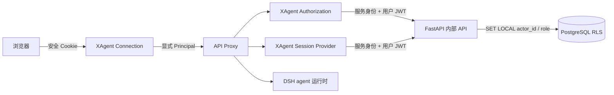

# XAgent Phase 2：认证与会话隔离设计

**状态：已确认，待实施**

**日期：2026-08-23**

## 1. 目标与范围

Phase 2 为 `xagent-business` 建立可用于多用户业务的认证、授权和会话持久化基础。浏览器、HTTP RPC、WebSocket、会话运行时和后续业务工具统一使用服务端验证的 Principal；私有会话与项目会话由同一授权服务和 PostgreSQL RLS 约束。

本阶段先把 JiaxinAgent 的 FastAPI 技术基线无历史导入 XxAgent，再只在 XxAgent 仓库开发。原 JiaxinAgent 仓库不接收 Phase 2 改动。该调整把 FastAPI 基础设施迁移从 Phase 3 前移，但不提前交付项目区、第三栏、文件能力或正式登录界面。

本设计细化[整体集成设计](2026-08-20-xagent-dsh-fork-integration-design.md)中的 Phase 2，并继承 [Phase 1 产品壳设计](2026-08-22-xagent-phase-1-product-shell-design.md)的 Business/Developer Profile 隔离。

## 2. 已确认决策

1. FastAPI 提供邮箱与密码登录，密码使用 Argon2id 强哈希；认证接口预留未来 OIDC 提供方。
2. Phase 2 的数据模型和授权服务支持项目会话，前端只开放私有会话；项目区和第三栏在 Phase 3 实现。
3. DSH 不持有 PostgreSQL 凭据；FastAPI 在同一事务内验证 Principal、设置数据库 actor context、执行 RLS 查询和写入。
4. `xagent-business` 强制认证；`xagent-developer` 保持回环地址开发模式，不连接生产业务数据、凭据或会话存储；普通 DSH Profile 的行为不变。
5. Principal 显式沿 RPC 调用传递，不能从请求体、客户端身份头或进程级全局变量取得。
6. 登录态使用服务端登录记录与短期 JWT；每个受保护操作复核账号状态、登录记录和权限版本。
7. JiaxinAgent 后端完整技术基线先导入 `services/api/`，后续实现和数据库迁移只发生在 XxAgent。
8. XAgent 文档继续使用中文；每份新增文档通过精确路径登记仓库所有者批准的中文专属例外，不使用目录通配。

## 3. 后端基线迁移

### 3.1 来源与目标

| 项目 | 值 |
| --- | --- |
| 来源仓库 | `git@github.com:VinceLi-18/JiaxinAgent.git` |
| 来源提交 | `32eb79ff331b50f7cf35c3f377e6f7eeaaa9230d` |
| 来源目录 | `backend/` |
| 目标目录 | `services/api/` |
| 导入方式 | 复制来源提交中 Git 已跟踪文件，不导入 Git 历史 |

导入范围包括 FastAPI 应用、SQLAlchemy 模型、Alembic 迁移、PostgreSQL RLS、MinIO 适配器、ClamAV 调用、测试、`pyproject.toml`、`alembic.ini` 和后端 Dockerfile。根级编排只迁入该服务实际需要的配置，并改为 XxAgent 自有编排；不得复制 JiaxinAgent 前端。

不得复制 `.git`、`.env`、密钥、数据库卷、MinIO 对象、测试缓存、虚拟环境、构建产物或未跟踪文件。导入提交记录来源 URL、固定提交、文件清单和排除项，使后续差异可以从同一基线重建。

### 3.2 行为基线

迁移提交只允许修改导入后的路径、包元数据、容器工作目录、测试启动命令和 XxAgent 顶层工具接线。账号、项目、临时授权、Artifact、审计、RLS 和既有 API 响应保持来源提交的行为。

迁移后的 Python 服务使用独立依赖环境和锁定文件；Node workspace 不接管 Python 依赖解析。XxAgent 顶层命令提供安装、迁移、测试和本地启动入口，但不隐藏底层命令的失败。

原 JiaxinAgent 仓库保持不变。Phase 2 的所有新增表、路由和测试只提交到 XxAgent。Phase 3 直接基于 `services/api/` 继续迁移项目、登录产品界面和 Artifact UI，不重复导入 FastAPI 基础设施。

## 4. 组件划分

Phase 2 新增或扩展以下职责：

| 组件 | 职责 |
| --- | --- |
| FastAPI auth | 密码校验、登录记录、JWT 签发、introspection、退出与账号管理命令 |
| FastAPI XAgent session API | 在一个事务内完成认证、RLS、会话索引和事件追加 |
| XAgent Principal | 定义并验证当前 actor、角色、权限版本和连接标识 |
| XAgent authorization | 对所有会话操作执行统一的访问决策和错误映射 |
| XAgent session provider | 把 DSH 会话持久化接口适配到 FastAPI，不提供 Business 本地回退 |
| XAgent delegation token | 签发并验证 DSH 到 FastAPI 的短期业务委托令牌 |
| Connection | 为 HTTP RPC 和 WebSocket 创建经过认证的请求上下文 |
| API Proxy | 显式接收请求上下文，并在执行任何会话操作前调用授权服务 |

认证和授权能力通过 Cordis 插件组合到 `xagent-business`。通用 Connection、Gateway 和 API Proxy 只增加可选的请求上下文扩展点；没有安装 XAgent 插件的 Profile 继续使用现有本地访问策略。

## 5. Principal 与登录态

Principal 包含 `actorId`、`role`、`permissionRevision`、`authSessionId` 和 `connectionId`。这些值只来自 FastAPI 验证结果；浏览器请求体、查询参数、Cookie 之外的身份头、模型参数和工具参数均不可信。

FastAPI 登录流程如下：

1. 浏览器向 DSH Host 的 `/auth/login` 提交邮箱、密码和 CSRF 数据。
2. DSH Host 把请求转发到 FastAPI，且不记录凭据正文。
3. FastAPI 使用 Argon2id 验证 `xagent_account_credentials` 中的密码哈希，检查账号有效状态，并创建 `xagent_auth_sessions` 记录。
4. FastAPI 签发包含 `sub`、`sid`、`role`、`permission_revision`、`iat`、`exp` 和 `jti` 的 JWT。
5. DSH Host 将 JWT 写入 `HttpOnly`、`SameSite=Strict` Cookie；生产环境强制 `Secure`，只有显式配置的回环开发模式可以关闭。
6. 浏览器 JavaScript 不读取、保存或转发 JWT。

登录态固定有效八小时。Phase 2 不提供刷新令牌、“记住我”、公开注册或找回密码。受控管理命令负责创建账号凭据和设置或重置密码；命令不得输出明文密码或密码哈希。

退出操作在 FastAPI 撤销 `xagent_auth_sessions` 记录，然后由 Host 清除 Cookie。单纯清除 Cookie 不构成服务端退出。账号停用、角色变化、项目成员或临时授权变化会推进受影响账号的权限版本，使旧 Principal 失效。

## 6. 请求认证与连接生命周期

每个受保护 HTTP RPC 都先验证 Cookie，并通过 FastAPI introspection 确认 JWT 签名、到期时间、登录记录、账号有效状态、当前角色和权限版本。认证失败统一返回稳定的未认证错误，不调用 API Proxy。

WebSocket 在升级前执行相同验证，并把 Principal 固化到该物理连接。重连必须重新认证；客户端不能在帧内切换 actor。权限版本变化、登录记录撤销或账号停用后，服务端关闭相关订阅，后续帧不得继续使用旧 Principal。

长时间运行的轮次在模型调用、工具调用、会话事件追加和事件发布前复核权限。复核失败会取消轮次、停止发布正文并记录脱敏审计事件。检查结果可以在单个短操作内复用，但不能跨受保护操作或 WebSocket 重连当作持续授权。

所有状态变更接口除 Cookie 外还验证可信 Origin 和独立 CSRF Token。生产配置缺少安全 Cookie、CSRF、FastAPI 服务身份或公钥时，Business Profile 在加载阶段快速失败。

## 7. Profile 行为

`xagent-business` 必须安装 Principal、authorization 和远程 session provider。未认证请求不能 list、open、create、resume、fork、search、subscribe、send、cancel、archive 或 export 会话。FastAPI 不可用时失败关闭，不得读取 Phase 1 的本地会话目录。

`xagent-developer` 继续使用独立的本地会话、凭据和设置目录，只在回环地址运行。它不加载 Business FastAPI 地址、服务凭据、委托令牌私钥或生产会话 provider。

普通 `web`、`headless` 和其他上游 Profile 不自动启用 XAgent 认证。通用包新增的请求上下文扩展点必须保持现有调用方和测试行为。

## 8. 数据模型

### 8.1 身份与登录表

| 表 | 主要字段与约束 |
| --- | --- |
| `xagent_account_credentials` | `account_id` 唯一外键、`password_hash`、`password_changed_at`；只由认证与管理命令访问 |
| `xagent_auth_sessions` | `id`、`account_id`、`jti_hash`、`created_at`、`expires_at`、`revoked_at`、`last_verified_at` |
| `xagent_permission_revisions` | `account_id` 唯一外键、单调递增 `revision`、`updated_at` |

现有 `accounts`、`projects`、`project_memberships` 和 `temporary_project_grants` 仍是身份、角色和项目权限真源。新增数据库触发器只推进 `xagent_permission_revisions`，不改变既有表字段、查询结果或公开 API 响应。

### 8.2 会话表

| 表 | 主要字段与约束 |
| --- | --- |
| `xagent_sessions` | `id`、`owner_id`、可空 `project_id`、`visibility`、创建时权限版本快照、标题、归档状态、最后事件序号、乐观锁版本、时间戳 |
| `xagent_session_events` | `session_id`、单调递增 `sequence`、事件类型、事件 schema 版本、JSONB payload、`actor_id`、可空 `tool_call_id`、可空 `audit_id`、时间戳 |
| `xagent_idempotency_keys` | 调用方、操作、幂等键、请求摘要、结果引用和到期时间；同一键不能对应不同请求 |

`private` 会话必须有 `owner_id` 且没有 `project_id`；`project` 会话必须同时记录创建者 `owner_id` 和 `project_id`。`visibility`、`owner_id` 与 `project_id` 创建后不能通过普通更新改变。

会话事件仅追加。`session_id + sequence` 唯一，追加请求携带期望序号；序号冲突返回可重试的并发错误。幂等键相同且请求摘要相同的重试返回原结果，摘要不同则拒绝。

`xagent_sessions` 是列表和搜索使用的索引投影，不能代替事件日志恢复 agent 运行状态。DSH 会话事件类型和格式版本继续由 DSH 会话子系统定义，FastAPI 只验证协议版本、存储约束和授权字段。

### 8.3 现有对话表

`conversation_threads` 在 Phase 2 保持来源基线的行为，XAgent Business 不读取或写入该表。它不再扩展为第二份完整会话历史。Phase 3 在迁移项目和对话界面时设计一次性归档或映射；在此之前两者用途必须由路由和测试明确隔离。

## 9. 会话授权

私有会话只允许 `owner_id` 对应账号访问。Manager 角色不获得其他用户私有会话的读取、搜索、fork、订阅或导出权限。

项目会话要求访问者当前可访问 `project_id`。项目所有者和正式成员按现有项目策略访问；临时授权必须未到期且包含当前操作需要的 `read` 或 `edit`。Phase 2 前端只能创建私有会话，项目会话通过受控内部测试入口验证。

以下操作全部调用同一授权服务：list、open、create、resume、history、search、fork、subscribe、send、queue update、cancel、rename、archive、attachment metadata 和 export。新增会话方法必须显式声明所需的 read、edit 或 owner 权限；没有声明的 Business 方法默认拒绝。

FastAPI 在同一数据库事务内完成用户验证、`SET LOCAL actor_id/role`、RLS 查询和数据操作。不可见与不存在的会话对浏览器统一返回 404，日志可使用内部原因码，但不得向调用方泄露对象是否存在。

权限版本快照只记录会话创建时的授权状态，不能替代当前授权。每个受保护操作都比较当前权限版本；项目成员被移除后，既有会话和订阅立即失效。

## 10. FastAPI 内部接口

浏览器不能直接访问 `/internal/xagent/*`。内部接口同时验证 DSH 服务身份和用户 JWT，并设置独立超时、请求体上限和脱敏日志。

| 接口 | 用途 |
| --- | --- |
| `POST /internal/xagent/auth/introspect` | 返回当前 Principal 或稳定认证错误 |
| `POST /internal/xagent/sessions/list` | 返回当前 actor 可见的会话索引 |
| `POST /internal/xagent/sessions` | 原子创建私有或受控项目会话 |
| `POST /internal/xagent/sessions/{id}/open` | 授权后返回索引和事件基线 |
| `POST /internal/xagent/sessions/{id}/events` | 分页读取授权范围内的事件 |
| `POST /internal/xagent/sessions/{id}/append` | 以期望序号和幂等键追加事件 |
| `POST /internal/xagent/sessions/{id}/fork` | 原子复制授权范围内的事件前缀 |
| `POST /internal/xagent/sessions/{id}/archive` | 归档当前 actor 可编辑的会话 |

接口使用版本化 JSON schema 和稳定错误码。DSH 把认证失败、不可见、并发冲突、幂等冲突、版本不支持和服务不可用映射为现有 RPC 错误模型，不返回 SQL、表名、JWT 内容或内部堆栈。

DSH 调用内部接口时携带仅 Host 可读的服务身份和 Cookie 中的用户 JWT。用户 JWT 不能进入浏览器可见响应、会话事件、模型上下文或普通日志。

## 11. 会话运行时与持久化顺序

Business 会话 provider 通过 FastAPI 读取事件基线并恢复 DSH agent。任何会影响模型输入、工具执行或用户可见 transcript 的状态都必须先成功追加相应会话事件，再继续下一项不可逆操作。

创建、fork 和首次 agent 发布必须具备失败原子性。FastAPI 事务失败、事件序号冲突或授权失效时，不得在 DSH registry 留下可访问的半成品 agent 或会话。

FastAPI 或 PostgreSQL 不可用时，读取返回可重试服务错误，写入停止后续模型调用或业务执行。Business Profile 不回退到 JSONL、SQLite 或 Phase 1 本地目录。重连从 FastAPI 取得新的授权基线和事件序号，不信任客户端游标作为权限证明。

## 12. 委托令牌

DSH 到 FastAPI 的业务委托令牌使用 Ed25519。私钥只存在于 Business Host，FastAPI 配置对应公钥；Developer Profile 不加载该密钥。

令牌有效期不超过 60 秒，固定 issuer 和 audience，并包含 `actor_id`、可空 `project_id`、`session_id`、`tool_call_id`、`tool_name`、`permission_revision`、`expires_at` 和 `nonce`。FastAPI 验证签名、时间、当前权限、会话范围和工具登记信息。

Phase 2 交付签发与验证库、配置校验和契约测试。过期、篡改、错误 audience、项目或会话不匹配、权限版本陈旧和重复 nonce 必须失败。实际业务工具从 Phase 4 开始消费该令牌。

## 13. 安全与故障处理

- 密码、Cookie、JWT、服务身份、委托私钥和事件正文不得进入日志、错误详情或审计 payload。
- 密码校验使用统一外部错误和近似一致的工作量，不能通过响应区分未知邮箱与错误密码。
- JWT 只接受固定算法、issuer 和 audience；拒绝缺失、重复或类型错误的必要 claim。
- 登录、introspection 和写接口执行限流；登录失败不创建服务端登录记录。
- 服务身份与用户 JWT 缺一不可；浏览器伪造内部请求头不能调用内部接口。
- Origin、CSRF、Cookie 和 WebSocket 验证使用同一允许来源配置。
- 权限撤销会取消运行中轮次、关闭订阅并拒绝后续事件；已经持久化的事件保持审计可追溯，但不再向无权 actor 返回正文。
- FastAPI、PostgreSQL 或授权插件缺失时 Business Profile 失败关闭。
- 数据库迁移先添加对象和策略，再切换 Business provider；回滚先切回未启用认证的旧部署，不允许新旧 Business 写路径并行。

## 14. 测试与验收

### 14.1 后端迁移基线

- 导入清单只包含固定来源提交的 Git 已跟踪后端文件和明确的 XxAgent 路径适配。
- JiaxinAgent 来源后端的健康检查、JWT、账号与项目隔离、RLS、Artifact、审计、MinIO 和 ClamAV 测试在 `services/api/` 通过。
- Python 包构建、Alembic 升级与降级在空数据库通过。

### 14.2 认证与授权

- Alice 与 Bob 只能看到各自的私有会话；Manager 不能读取其他用户私有会话。
- 项目所有者、成员、临时 read/edit 授权和过期授权符合现有项目策略。
- 猜测会话 ID、搜索、fork、事件读取、订阅、归档和 WebSocket 重连均不能绕过授权。
- 未认证、Cookie 篡改、账号停用、登录撤销、角色变更和项目成员移除立即阻止后续操作。
- CSRF、错误 Origin、伪造 actor/role/revision、内部请求头伪造和委托令牌重放被拒绝。

### 14.3 持久化与并发

- 会话创建、fork、事件追加和 agent 发布失败时不留下半成品状态。
- 并发事件追加只有一个期望序号成功；相同幂等请求返回同一结果，不同请求复用键时失败。
- FastAPI 不可用或事件写入失败时不继续模型调用，也不回退本地存储。
- 重启后从 PostgreSQL 事件恢复的 transcript、轮次状态和最后序号与写入前一致。

### 14.4 Profile 与端到端测试

- `xagent-business` 未登录时只显示简洁的需要登录阻断页，不返回会话数据。
- 双浏览器上下文通过真实登录接口取得 Cookie，并验证 HTTP、WebSocket、会话列表、创建、打开、发送、取消和退出隔离。
- `xagent-developer` 与普通 DSH Profile 的现有本地行为保持不变。
- 构建版 Business Web、类型检查、构建、Python 测试、相关 TypeScript 测试、契约测试、文档门禁和差异检查全部通过。

## 15. 不在本阶段实现

- 正式登录产品界面、公开注册、找回密码、OIDC、刷新令牌和“记住我”；
- 项目区、常驻第三栏、协作收件箱和项目操作 UI；
- 配色调整；
- Artifact 产品界面、文件上传、预览、扫描和 MinIO 新流程；
- 业务工具、业务 agent、持久审批和业务 Skill；
- JiaxinAgent 前端迁移；
- `conversation_threads` 数据转换或删除。

## 16. 实施与提交边界

Phase 2 先提交可独立验证的后端基线导入，再提交认证与会话能力。每个任务使用先失败测试、最小实现、聚焦验证和独立提交；通用 DSH 核心改动与 XAgent 专用插件分开审查。

建议的实施单元为：后端基线导入、认证数据模型、登录与管理命令、FastAPI 会话存储、Principal 与请求上下文、Connection HTTP/WebSocket 认证、API Proxy 授权、远程会话 provider、委托令牌、双账号与撤权端到端测试、文档和最终验收。
