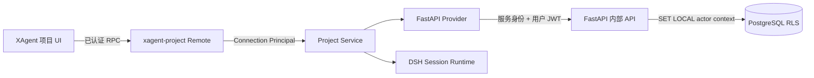

# XAgent Phase 3A：项目工作台与三栏界面设计

**状态：已确认，待实施**

**日期：2026-08-25**

## 1. 目标与范围

Phase 3A 为 `xagent-business` 提供正式登录界面、账号级工作上下文、项目导航、项目会话和常驻项目详情栏。用户在“我的工作台”处理私有任务与跨项目分析，在单个项目上下文中处理该项目的共享会话；两类会话继续使用 Phase 2B 的 Principal、FastAPI 事务和 PostgreSQL RLS 授权链。

本设计细化[整体集成设计](2026-08-20-xagent-dsh-fork-integration-design.md)中的 Phase 3，并直接复用 [Phase 2 认证与会话隔离设计](2026-08-23-xagent-phase-2-auth-session-isolation-design.md)。所有实现只进入 XxAgent；JiaxinAgent 仓库和通用 DSH Profile 的产品行为保持不变。

Phase 3 以两个独立交付单元实施：Phase 3A 交付项目工作台、三栏界面和旧对话存储收口，Phase 3B 交付 Artifact 上传、扫描、预览和下载。Phase 3A 不提前提供 Artifact 产品流程、真实协作收件箱、跨项目统计工具或业务 Agent。

## 2. 已确认决策

1. 采用 XAgent 专属插件族接入 DSH Slot，不迁入 JiaxinAgent React 应用，也不把项目语义写入通用 DSH Workspace。
2. 左栏只有“我的工作台”和可访问项目两类入口；不增加独立的“工作总览”入口。
3. “我的工作台”同时承载私有任务和跨项目分析；项目上下文只承载单项目会话。
4. 项目是当前工作上下文。选择项目后只展示该项目会话，新建会话自动绑定该项目；选择“我的工作台”时只展示私有会话。
5. `project.create` 是账号级权限。管理员默认具备；专员默认不具备，只有管理员显式授权后才能创建项目。
6. Phase 3A 通过账号管理 CLI 授予、撤销和查看 `project.create`，不交付用户权限管理页面。
7. 当前上下文作为账号级服务端偏好保存。切换账号时先清空客户端状态，再从服务器读取新账号偏好并重新验证项目可见性。
8. 第三栏在宽屏常驻，提供“概览”和“协作收件箱”页签；收件箱只显示明确空状态，不使用演示数据。
9. 正式登录页替换临时登录阻断卡；登录后左栏显示当前账号、角色和退出入口。
10. XxAgent 中的 `conversation_threads` 及其 API 被删除，不迁移、不双写；Alembic downgrade 只恢复空表结构。
11. 配色、字体和主题令牌保持当前状态，等待后续统一调整。
12. XAgent 文档使用中文；每份新增文档通过精确路径登记中文专属例外，不使用目录通配。

## 3. 总体架构

项目能力遵循 Service Definition、Provider 和 Consumer 分工：

| 组件 | 职责 |
| --- | --- |
| `@xagent/dsh-project` | 项目、工作上下文、有效能力和失败类型的 Service Definition |
| FastAPI Provider | 通过 `@xagent/dsh-backend-client` 调用固定内部接口，不持有数据库凭据 |
| Project Remote | 把已认证 Connection 的 Principal 与用户令牌显式传给 Project Service |
| `@xagent/dsh-ui-project` | 左栏项目浏览、上下文标识、第三栏概览与收件箱空状态 |
| `@xagent/dsh-ui-account` | 正式登录页、当前账号与退出入口 |

浏览器不读取、保存或转发 FastAPI Bearer Token。Host 从受保护 Cookie 建立 Connection Principal，Project Remote 不接受请求 payload 中的 actor、role、permission revision、visibility 或 owner 字段。

`xagent-business` 显式组合上述插件。`xagent-developer`、普通 DSH Profile 和 JiaxinAgent 不加载 XAgent 项目 Provider、Remote 或 UI。

## 4. 工作上下文

### 4.1 上下文类型

用户界面只有两类上下文：

| 上下文 | Session 字段 | 用途 |
| --- | --- | --- |
| 我的工作台 | `visibility=private`、`project_id=null` | 私有任务、跨项目分析和个人会话 |
| 单个项目 | `visibility=project`、`project_id=<当前项目>` | 只处理该项目的共享会话 |

工作台不是伪项目，不创建 `projects` 记录，也不获得项目成员关系。项目上下文不能隐式读取其他项目；工作台中的跨项目读取由后续业务工具显式声明项目集合，并按当前 Principal 授权。

### 4.2 选择与恢复

服务器为每个账号保存一个上下文偏好：`workbench` 或 `project + project_id`。Bootstrap 读取偏好后重新检查项目访问权；项目不存在、成员关系失效或临时授权过期时，返回规范化的 `workbench` 并同步修正持久偏好。

切换上下文先由服务器保存并返回规范化结果，客户端收到成功响应后才更新左栏、中央和第三栏。切换过程禁用新建会话，避免新 Session 绑定旧上下文。

切换上下文不会移动、重写或重新授权当前 Session。客户端离开当前会话并显示目标上下文的空白态或会话集合；用户重新选择原范围后仍可打开原 Session。

### 4.3 账号切换

认证账号变化、退出或权限版本失效时，客户端先清空项目列表、上下文、会话选择和第三栏内容，再请求新账号 Bootstrap。任何账号缓存都不能作为另一个账号请求期间的占位内容。

上下文偏好只保存在服务器。浏览器可以在单次已认证页面生命周期内保留响应快照，但不能用 `localStorage` 或未分区持久缓存恢复项目数据。

## 5. 项目创建权限

`project.create` 是独立账号能力，不由前端角色判断替代：

- Manager 的有效能力集合默认包含 `project.create`；
- Specialist 只有存在有效显式 grant 时包含 `project.create`；
- 项目创建接口在数据库事务内检查有效能力；
- UI 只根据 Bootstrap 返回的能力决定是否显示入口，隐藏按钮不构成授权；
- 授予、撤销或角色变化递增该账号的 `permission_revision`，旧连接按 Phase 2B 机制失效。

账号管理 CLI 提供授权、撤销和查看有效权限命令。重复授权和重复撤销具有幂等结果，不创建重复记录；CLI 不接受不存在的 capability 名称。

创建项目时，FastAPI 在同一事务内校验能力、创建项目、建立所有权并把该项目设为当前上下文。响应只在事务提交后返回，避免项目创建成功但选择失败的部分状态。

## 6. 数据模型

### 6.1 账号能力

`xagent_account_capability_grants` 包含 `account_id`、`capability`、`granted_by_id` 和 `created_at`，并以 `account_id + capability` 唯一。只存储显式 grant；Manager 默认能力由授权服务计算。

grant 只能引用有效账号和管理员授予者。账号停用不删除 grant，但有效能力为空；重新启用后按当前角色和 grant 重新计算。

### 6.2 工作上下文偏好

`xagent_workbench_preferences` 以 `account_id` 唯一，包含 `context_kind`、可空 `project_id` 和 `updated_at`。`workbench` 必须没有 `project_id`，`project` 必须有 `project_id`；数据库检查约束拒绝其他组合。

偏好不是权限证明。读取、写入和创建 Session 均重新检查项目可见性。

### 6.3 跨项目 Session 引用

`xagent_session_project_refs` 以 `session_id + project_id` 唯一，记录工作台 Session 的模型可见结果引用过的项目。只有 `private` Session 可以写入该表；项目 Session 的项目范围由 `xagent_sessions.project_id` 表示。

后续跨项目工具必须在同一 FastAPI 事务内完成项目授权、引用登记和模型可见结果持久化。打开、恢复、fork 或继续工作台 Session 时，授权服务检查全部引用项目；任一项目不再可见时，对调用方统一返回 `session-not-found`，不泄露具体失权项目。

Phase 3A 建立数据模型与授权检查，不提供实际跨项目统计工具，也不写入演示引用。

## 7. FastAPI 与 RPC 接口

浏览器不直接调用 `/internal/xagent/*`。内部接口同时验证 Host 服务身份和用户 JWT，并使用版本化 JSON、固定请求体上限、超时和稳定错误码。

| 接口 | 用途 |
| --- | --- |
| `POST /internal/xagent/workbench/bootstrap` | 原子返回账号、角色、有效能力、规范化上下文、可访问项目和范围概况 |
| `POST /internal/xagent/workbench/context` | 保存并返回规范化的工作台或项目上下文 |
| `POST /internal/xagent/projects` | 检查 `project.create`，原子创建并选择项目 |
| `POST /internal/xagent/projects/{id}` | 返回当前 actor 可见的项目详情 |
| `POST /internal/xagent/session-project-refs` | 为工作台 Session 原子登记已授权项目引用 |

Bootstrap 是客户端首屏的唯一项目初始化请求，防止账号、项目、能力和偏好由多个响应拼接出跨账号中间状态。响应包含稳定账号标识、邮箱、角色、有效 capability 列表、当前上下文、项目安全字段和会话概况；不返回成员名单、内部授权原因或对象存储信息。

Project Remote 为每次调用取得当前 Connection 请求上下文。Host Provider 使用该上下文中的用户令牌调用 FastAPI；没有 Principal、令牌、服务身份或 Project Service 时失败关闭。

## 8. Session 创建、列表与授权

新建 Session 不接受浏览器提交的最终 `visibility` 或 `project_id`。Host 从 FastAPI 读取已确认的当前上下文，并把解析结果传给现有 XAgent Session 创建协议；FastAPI 在创建事务中再次验证上下文与项目访问权。

Session Header 保留 `visibility` 和 `project_id` 作为范围真源。左栏根据服务端返回的 Header 分组显示当前账号可见 Session：工作台只显示 private Header，项目只显示与当前项目 ID 相同的 project Header。前端过滤只决定展示，list、open、resume、fork、subscribe、send、archive 和事件读取仍经过统一授权。

项目成员或临时授权撤销后，项目 Session 立即不可见。工作台 Session 的项目引用失权后整条 Session 失败关闭；服务端不对事件日志做局部删改或静默脱敏，避免生成无法确定性回放的 transcript。

## 9. 三栏界面

### 9.1 左栏

XAgent Project Browser 填充现有 `sidebar.workspaces` Slot，替代 Business Profile 已禁用的通用 Workspace Browser。展开态依次显示“我的工作台”、项目区、当前范围会话和底部账号入口；折叠态保留现有 56px 控制栏行为。

项目区展示真实可访问项目。具有 `project.create` 时显示“新建项目”；创建表单只收集名称，成功后自动进入新项目。加载、空列表、无权限、服务不可用和创建失败均使用明确中文状态。

### 9.2 中央对话

中央继续使用 DSH Conversation，不复制消息、队列、重连、压缩或输入框实现。顶部增加一条紧凑的上下文标识，显示“我的工作台”或项目名；该标识来自服务器确认的上下文，不从当前 Session 标题推断。

上下文没有 Session 时显示与范围一致的空白态。工作台引导用户新建私有会话；项目引导用户在该项目中发起会话。Phase 3A 不展示 Artifact、统计指标或业务 Skill 示例数据。

### 9.3 第三栏

`ui-layout` 新增 root 级单占用 Slot `shell.details`。存在 registrant 时，布局在第三栏渲染该 Slot 并保持 root 生命周期；不存在时继续渲染现有 session 级 `details`，普通 DSH 和 Developer 的工具详情行为不变。

XAgent Business 注册 `shell.details`，提供“概览”和“协作收件箱”页签。工作台概览展示可访问项目数和私有会话概况；项目概览展示名称、创建时间、当前用户权限和项目会话概况。协作收件箱在 Phase 3A 只显示空状态和用途说明，不显示虚假未读数。

第三栏默认使用现有 360px 偏好和拖拽范围。宽度不足时沿用 DSH concession chain 优先自动收起第三栏；窄屏通过明确按钮以抽屉打开。关闭或自动收起只改变视图，不清除当前上下文。

### 9.4 视觉约束

Phase 3A 使用现有 `--dsw-*` 语义令牌、字体、圆角和焦点样式，不引入字面颜色、组件库或 Tailwind。信息层级接近 JiaxinAgent 的项目导航、Agent 画布和项目检查器，但实现建立在 XAgent 插件与 DSH Slot 上，不复制 JiaxinAgent 前端代码。

所有产品文案使用中文。键盘焦点、ARIA 名称、错误提示、空状态、减少动态效果和移动端抽屉必须与鼠标路径等价。

## 10. 正式登录与账号入口

`@xagent/dsh-ui-account` 通过 `shell.overlay` 提供独立登录页，并从通用 `ui-layout` 移除 XAgent 专属登录组件。只有 Host 返回 XAgent 认证标识时显示该界面；普通 Profile 不出现 XAgent 文案或认证请求。

登录页提供邮箱、密码、提交中、凭据错误和服务不可用状态。Phase 3A 不显示公开注册、找回密码、修改密码、刷新令牌、“记住我”或 OIDC 入口。

登录后左栏底部显示当前邮箱、角色和“退出登录”。退出先请求服务端撤销登录记录，成功或认证已失效后清除 Cookie 和所有客户端账号状态，再返回登录页；单纯隐藏界面不构成退出。

## 11. 并发、缓存与错误处理

- Bootstrap、上下文选择和项目创建响应携带账号 ID；客户端只接受与当前认证账号匹配的响应。
- 切换账号或退出会取消在途项目请求；迟到响应不能重新填充已清空状态。
- 切换上下文期间禁用新建会话；上下文确认后发起的 Session 创建仍在 FastAPI 事务内复核。
- 项目不存在和无权访问统一映射为 `not-found`；项目 Session 或跨项目引用失权统一映射为 `session-not-found`。
- 缺少 `project.create` 返回稳定 `forbidden`，不创建项目或修改偏好。
- 重复创建请求使用幂等键；相同请求返回同一项目，不同请求复用键返回幂等冲突。
- FastAPI、PostgreSQL、Project Provider 或认证服务不可用时失败关闭，不回退到本地项目或 Session 数据。
- 浏览器不持久化项目详情和会话内容；单页生命周期缓存按账号标识分区，并在身份变化时整体销毁。

## 12. 旧对话存储收口

XAgent Business 的对话权威是 `xagent_sessions` 与 `xagent_session_events`。Phase 3A 删除 `conversation_threads` 模型、路由、服务和测试，并通过 Alembic 删除该表。

删除操作不读取或迁移旧行，不建立兼容接口或双写。Alembic downgrade 重新创建空表、索引和约束，但不恢复已删除数据。JiaxinAgent 仓库及其数据库不参与该迁移。

## 13. 安全要求

- 项目、能力、上下文和 Session 范围只由 FastAPI 与 PostgreSQL 判定，客户端状态不是授权依据。
- Project Remote 忽略或拒绝 payload 中的 actor、role、owner、visibility、permission revision 和项目访问声明。
- Bootstrap 不返回不可见项目，也不通过计数、错误差异或缓存残留泄露其他账号项目。
- Manager 默认项目创建权限不扩大其对其他用户私有 Session 的访问。
- Specialist 的 `project.create` grant 不授予任何既有项目访问权。
- 工作台跨项目读取只覆盖当前可访问项目；引用登记失败时模型可见结果不得写入 Session。
- 邮箱、Cookie、JWT、服务身份、CSRF Token 和数据库错误不得进入 Session、模型上下文、普通日志或浏览器错误详情。
- Developer 和普通 DSH Profile 不接收 XAgent FastAPI 地址、服务凭据、账号缓存或项目 UI。

## 14. 测试与验收

### 14.1 FastAPI 与数据库

- Alembic 在空数据库完成 upgrade、downgrade 和再次 upgrade；旧对话 downgrade 只恢复空表。
- Manager 默认拥有 `project.create`；Specialist 默认拒绝，grant 后允许，revoke 后立即拒绝。
- 重复授权、撤销、上下文选择和项目创建符合幂等约束。
- 两个账号的偏好、项目列表、项目详情和创建结果不能串读。
- 项目失权后偏好回退工作台，项目 Session 与引用该项目的工作台 Session 均不可访问。
- 项目创建和设为当前上下文具有事务原子性。

### 14.2 TypeScript 与插件组合

- Service Definition、FastAPI Provider、Backend Client 和 Remote 覆盖成功、取消、超时、响应上限、错误映射和恶意 payload。
- Project 与 Account UI 插件的注册和 dispose 通过 HMR 测试。
- `shell.details` 有 XAgent registrant 时显示 root 详情，没有时保持现有 session 工具详情行为。
- Business Profile 必须组合完整项目与账号插件；Developer 和普通 Web 不组合这些插件。

### 14.3 UI 与真实组合

- 正式登录、错误凭据、退出和重新登录使用真实 Host/FastAPI Cookie 流程。
- 有权限账号创建项目后自动进入该项目；无权限账号看不到入口，直接 RPC 仍被服务端拒绝。
- “我的工作台”和项目切换只显示对应 Session，新建 Session 写入正确 visibility 与 project ID。
- 两个账号切换时先清空旧状态，再显示新账号从服务器恢复的上下文；迟到响应不能污染界面。
- 宽屏显示三栏，窄屏第三栏为可关闭抽屉；键盘和辅助技术路径可完成同等操作。
- 真实构建服务录制登录、项目创建、上下文切换、三栏展示、退出和第二账号登录 GIF，不使用静态模拟。

### 14.4 最终门禁

聚焦 Python 与 TypeScript 测试、相关覆盖率、`pnpm run test:gui`、构建版 Web、typecheck、build、lint、doc-sync 和差异检查全部通过。真实浏览器或网络测试若受沙箱阻断，必须用原命令在宿主环境复验，不能把环境失败记录为通过。

## 15. 不在本阶段实现

- Artifact 上传、病毒扫描、版本、预览、下载和 MinIO 新流程；
- 真实协作收件箱、未读状态、待办和通知；
- 跨项目统计工具、业务指标、项目检索、业务 Agent 和业务 Skill；
- 用户权限管理页面、公开注册、找回密码、OIDC 和刷新令牌；
- 项目成员管理、项目删除、重命名和归档界面；
- 配色、字体和品牌视觉调整；
- JiaxinAgent 前端或后端修改；
- 远端推送和 PR 创建。

## 16. 实施与回滚边界

Phase 3A 在 Phase 2B 本地分支之上使用独立 worktree。数据库、Host 能力、客户端 Slot 和产品界面按可独立验证的提交分开；每项行为先写失败测试，再做最小实现。

通用 DSH 改动只允许增加 XAgent 可消费的可选扩展点，并须证明没有 registrant 时行为不变。XAgent 项目语义不得进入通用 Workspace、Session 核心或 Developer Profile。

回滚按提交逆序执行。包含旧表删除的版本回滚只恢复空结构，因此生产部署前必须确认 XAgent 环境没有需要保留的旧对话数据；本阶段不提供旧数据恢复工具。

## 17. 备选方案

直接迁入 JiaxinAgent 前端会形成第二套 React 应用、认证状态和对话运行时，无法共享 DSH Session，因此不采用。

直接修改通用 DSH Sidebar 与 Details 会让项目语义进入普通 Profile，并增加对 Developer 的回归风险，因此只采用可选 Slot 和 XAgent Business registrant。

增加独立“工作总览”入口会让用户在个人、总览和项目三种上下文之间选择。Phase 3A 将个人与跨项目工作合并为“我的工作台”，把范围校验和 Session 项目引用放在服务端。

把“全部项目”伪装成项目会混淆所有权、成员、文件归属和分享语义；完全由 Agent 自动猜测范围又缺少可控性，因此均不采用。
