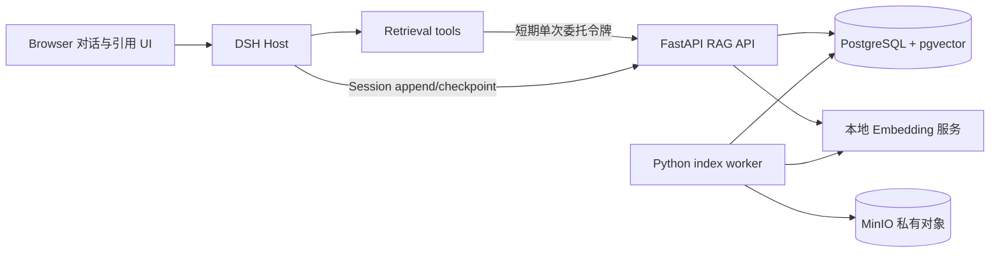

# XAgent Phase 4A：RAG 检索与引用设计

**状态：已确认，待实施**

**日期：2026-08-28**

## 1. 目标与范围

Phase 4A 为 `xagent-business` 交付只读的 RAG（检索增强生成）基础：把扫描通过的文本资料建立为可恢复索引，让项目会话检索当前项目，让个人会话以明确项目集合执行跨项目分析，并要求模型用可验证引用回答。中栏仍由 Agent 对话承载功能，资料右栏继续提供人工详情与预览入口。

本设计建立在 [Phase 3A 项目工作台](2026-08-25-xagent-phase-3a-project-workbench-design.md)和 [Phase 3B 资料生命周期](2026-08-25-xagent-phase-3b-artifact-lifecycle-design.md)之上，并细化[整体集成设计](2026-08-20-xagent-dsh-fork-integration-design.md)中的 Phase 4。Phase 4A 只实现读取、检索、引用和最小 DeepSeek 上下文；Phase 4B 再实现写工具、业务幂等、写操作审计、人工审批以及写任务的取消、重试、恢复和撤权处理。

### 1.1 目标

1. 扫描通过的 UTF-8 文本资料通过独立持久任务建立混合检索索引，API 或 worker 重启后能够继续处理。
2. 项目会话只能检索其固定项目；个人会话可以显式选择多个当前可访问项目，并可显式包含私人资料。
3. FastAPI 与 PostgreSQL RLS 在每个授权时点重新判定范围，不信任模型、Browser 或 Host 声明的访问权。
4. 检索结果以有界分片进入 Session 事件日志，并可从日志确定性重建模型上下文。
5. 使用检索证据的回答必须包含有效引用；引用可点击到已授权的不可变资料版本与行范围。
6. CPU-only Docker Compose 是最低部署能力，GPU 只作为可选加速，不改变协议和数据语义。

### 1.2 不在本阶段交付

- PDF、Office、图片、OCR、表格语义解析和多模态 Embedding；
- 资料上传、修改、删除、移动、分享、事实确认、文档生成或审批工具；
- 自动检索“全部可访问项目”、由模型猜测同名项目或首版跨项目多选 UI；
- HNSW 近似索引、检索缓存、回答缓存、外部向量数据库或独立 RAG 微服务；
- 无引用的证据型回答降级、只靠关键词的静默降级或无依据引用补写；
- Developer、普通 Web、Headless 或 JiaxinAgent 的 RAG 装配。

## 2. 已确认决策

1. FastAPI 与 PostgreSQL 是索引、授权、检索、检索收据、引用和审计的真源；Python worker 只负责读取、解析、切分和建立索引。
2. 首版只索引扫描状态为 `clean` 的 `text/plain`、Markdown、CSV 和 JSON；正文必须是严格 UTF-8，单版本索引上限为 10 MiB。
3. 检索采用固定 BGE-M3 稠密向量、PostgreSQL 全文与 trigram 关键词的混合检索；首版在 RLS 过滤后做精确向量搜索，不创建 HNSW。
4. 新版本索引在未发布 generation 中构建；只有完整成功后才原子切换搜索 head，旧的 ready 索引在此之前继续服务。
5. 项目会话由 Session Header 的单一 Project ID 固定范围；个人会话的每次跨项目检索必须携带显式 Project ID 集合。
6. 私人资料只允许个人会话通过显式 `include_private=true` 检索，默认值为 `false`。
7. 首版不提供项目多选器。模型先调用 `list_accessible_projects` 解析 Project ID，再调用 `search_artifacts`；同名或模糊名称必须向用户澄清。
8. 检索工具返回会话内唯一的短引用 ID `[资料N]`。模型采用证据时必须输出这些 ID；未知、跨会话或已撤权引用均无效。
9. 证据型最终回答先缓冲并校验。第一次无效回答不展示，系统持久化纠正事件并重试一次；第二次无效则明确失败。
10. 点击引用时重新授权，不持久化或复用签名读取 URL。引用定位到不可变 Version、Chunk 和行范围。

## 3. 架构与职责

### 3.1 FastAPI 与 PostgreSQL

FastAPI 拥有资料范围解析、项目集合授权、查询 Embedding、候选检索、排序、检索收据、Session 证据入账、引用重授权和审计。应用数据库角色继续使用 Principal RLS；索引 worker 使用受限 worker 角色，不获得账号、项目成员或 Session 业务写权限。

PostgreSQL 保存索引 generation、分片、向量、关键词索引、持久任务、当前搜索 head 和检索收据。查询必须先把 actor、Session 和项目范围写入事务上下文，再访问可搜索 head；应用层过滤不能替代 RLS。

### 3.2 Python worker 与 Embedding 服务

索引 worker 领取 PostgreSQL 持久任务，从 MinIO 流式读取指定 `clean` Version，严格解码 UTF-8，按行和段落切分，调用本地 Embedding 服务，然后在一个未发布 generation 中写入全部分片。worker 不执行用户检索、不签发检索收据，也不决定当前 actor 的权限。

Embedding 服务在内部容器网络提供批量文本到向量的窄接口，同时服务索引 worker 与 FastAPI 查询。它不暴露宿主端口，不接收用户身份，不保存正文，不记录原始文本，并固定模型名称、revision、维度和归一化方式。CPU-only 是 Compose 必选路径；GPU overlay 只能改变执行设备和批量性能。

### 3.3 DSH Host

`@xagent/dsh-retrieval` 提供 Service Definition 与 FastAPI Service Provider，负责委托令牌、严格协议解析、取消传播、超时、结果上限、检索收据随 Session append 提交以及完全停稳的 dispose。

`@xagent/dsh-tool-retrieval` 提供模型可调用的 `list_accessible_projects` 与 `search_artifacts`。它从已认证的 XAgent 请求范围取得 Principal、用户令牌、Session ID、Session visibility 和固定 Project ID，不接受工具参数伪造这些字段。

`@xagent/dsh-ui-citation` 从已持久化的 Session 证据事件渲染引用条和点击行为。`@xagent/dsh-ui-artifact` 提供窄的只读 `openCitation(ref)` 客户端能力，复用现有详情、版本和预览流程；引用 UI 不复制资料读取逻辑。

### 3.4 组合范围

只有 `xagent-business` 装配 Retrieval Service、两个工具、引用校验和引用 UI。`xagent-developer`、普通 Web、Headless 与 JiaxinAgent 不获得 FastAPI RAG 地址、Embedding 配置、检索工具或引用 UI。

## 4. 索引数据模型

### 4.1 `artifact_text_indexes`

每行表示一个 Version 的一次完整索引 generation，至少包含 Index ID、Artifact ID、Version ID、generation、内容 SHA-256、解析器 revision、Embedding 模型与 revision、向量维度、状态、分片数、稳定失败码和时间字段。

状态为 `building | ready | failed`。`ready` 只表示该 generation 内部完整，是否参与搜索由 `artifact_search_heads` 决定。相同 Version 和相同索引配置指纹不得产生多个并发 building generation。

### 4.2 `artifact_text_chunks`

每行属于一个 Index，包含从 0 递增的 ordinal、正文、起止行号、BGE token 数、正文 SHA-256、`vector(1024)` 稠密向量、`tsvector` 和供 `pg_trgm` 使用的规范化文本。`(index_id, ordinal)` 唯一，行范围必须位于不可变 Version 的已解析正文内。

分片正文和向量只允许通过 RLS 保护的检索路径读取。应用日志、审计、Job 错误和模型调用诊断不得包含分片正文或向量。

### 4.3 `artifact_index_jobs`

每行对应一个待建立的 Index，沿用 Phase 3B 持久队列语义：状态、尝试次数、下次执行时间、租约令牌、租约过期时间和稳定失败码分离保存。领取使用 `FOR UPDATE SKIP LOCKED`，完成和失败更新必须匹配当前租约。

### 4.4 `artifact_search_heads`

每个 Artifact 最多一行当前搜索 head，引用一个 `ready` Index 及其 Version。新 generation 的全部分片、关键词索引和向量写入成功后，worker 在一个事务中验证 Version 仍为 `clean`、Index 配置匹配并原子替换 head。

切换失败或新 generation 失败时，既有 head 不变。历史 ready Index 与分片在 Phase 4A 保留，用于已经持久化的引用；本阶段不实现历史索引清理。

### 4.5 `xagent_retrieval_receipts`

检索收据以 `project_discovery | artifact_search` 区分项目发现与资料搜索，并绑定 actor、Session、tool call、查询 SHA-256、规范化检索范围、permission revision、返回项目集合、索引 generation 集合、返回分片集合、模型可见 payload SHA-256、签发时间、五分钟过期时间和消费状态。

`xagent_sessions` 增加 `next_citation_ordinal`。资料搜索在签发收据的事务中锁定 Session、预留连续 ordinal 并推进该字段，使并发工具调用不会产生重复的 `[资料N]`；过期或未消费收据留下的 ordinal 空洞不复用。

收据只允许一次逻辑消费。相同 Session 事件 ID 和相同 payload 的 append 重放返回原结果；不同 payload 复用收据失败，避免网络重试把一次成功入账变成不可恢复错误。

## 5. 索引生命周期

1. Artifact Version 进入 `clean` 后，在同一业务事务中创建独立 Index 与 index Job；扫描任务不等待解析或 Embedding。
2. 不支持的 MIME 记录稳定 `unsupported-content`，严格 UTF-8 失败记录 `invalid-utf8`，超过 10 MiB 记录 `index-too-large`。这些资料仍可按 Phase 3B 规则人工预览或下载。
3. 可恢复的 MinIO、Embedding 或数据库错误使用有限指数退避。超过尝试上限记录 `indexing-failed`，既有搜索 head 继续服务。
4. worker 以 512 个 BGE token 为目标切分，重叠 64 token，优先在段落和换行处结束；单分片 UTF-8 序列化不得超过 8 KiB。
5. worker 批量取得归一化的 1024 维向量，写入全部 Chunk，并核对分片 ordinal、token 上限、行范围和内容摘要。
6. Index 完整后进入 `ready` 并原子切换 head。新 Version 的扫描完成不直接移除旧 head；新 Index 发布后才改变搜索结果。
7. 解析器 revision、模型 revision、切分参数或规范化规则变化时创建新 generation，不原地改写历史 Chunk。

## 6. Embedding 与混合检索

Phase 4A 固定使用 [BAAI/bge-m3](https://huggingface.co/BAAI/bge-m3) 的 dense 模式，向量维度 1024，模型 revision 必须以不可变提交或镜像摘要固定。模型支持多语言与长输入，但本阶段把查询限制为 512 BGE token，把分片限制为 512 token，以控制 CPU 延迟、内存和模型上下文。

PostgreSQL 使用 [pgvector](https://github.com/pgvector/pgvector) 做精确余弦搜索，并以 `simple` 文本配置的全文检索和 `pg_trgm` 相似度形成关键词候选。项目与私人范围先经过 RLS 和 active head 过滤，再分别取得向量 Top 40 与关键词 Top 40；首版不在 HNSW 过滤语义上承担召回风险。

两路候选使用 Reciprocal Rank Fusion 合并，固定 `k=60`。最终最多返回 8 个分片，每个 Artifact 最多 3 个；排序相同时按融合分、Artifact ID、Version ID 和 ordinal 确定性排序。

查询最长 512 BGE token。工具的完整模型可见结果最多 32 KiB 且最多 4096 BGE token；达到任一上限时按排序截断完整分片，不截断 UTF-8 字符或伪造半个引用。Phase 4A 不缓存查询向量、候选、工具结果或最终回答。

Embedding 服务不可用时返回 `retrieval-unavailable`，不得静默退化为关键词检索。没有候选是正常空结果，工具明确说明未找到证据，不生成占位引用。

## 7. Session 与检索范围

### 7.1 项目会话

项目会话只搜索 Session Header 的固定 Project ID。`search_artifacts` 在项目会话中拒绝 `project_ids` 与 `include_private=true`；FastAPI 重新验证该项目的当前访问权，失权统一返回 `session-not-found`。

### 7.2 个人会话

个人会话的 `search_artifacts` 参数必须包含非空 `project_ids`、`include_private=true`，或两者同时存在。`project_ids` 去重后最多 20 个；FastAPI 以一个授权快照验证集合中的每个项目，任一项目不存在、不可见或已失权时整体失败，不返回部分结果或具体失败项目。

`include_private` 默认 `false`，只在个人会话有效。私人资料与项目资料可以在一次检索中合并排序，但收据和审计分别记录私人范围标志与项目集合摘要。

### 7.3 项目发现工具

`list_accessible_projects` 只在个人会话提供当前可访问项目的 ID 与名称，支持有界名称查询，最多返回 20 项，不返回成员、权限来源或不可见项目计数。模型遇到同名或模糊结果时必须向用户澄清，不能自动选择第一项。

首版 UI 不提供跨项目多选器。“全部可访问项目”不是合法隐式范围；用户要求全局分析时，模型仍须发现并显式提交当前项目集合。

## 8. 工具与 FastAPI 接口

### 8.1 模型工具

`list_accessible_projects` 接受可选 `query`，返回有界的 `{ project_id, name }` 列表及不进入模型正文的项目发现收据。项目发现结果必须通过 checkpoint 入账并登记返回的 Project ID，但不分配资料引用，也不触发回答引用要求。

`search_artifacts` 接受 `query`、个人会话可用的 `project_ids` 和 `include_private`。`limit` 不暴露给模型；服务端固定执行本设计的候选和结果上限。

每个搜索结果包含短引用 ID、Artifact ID、Version ID、文件名、版本号、起止行号、分片正文和有限的范围标签。对象 Key、签名 URL、向量、内部分数、权限来源、用户令牌和收据密文不得进入模型结果。

### 8.2 委托令牌

Host 为每次工具调用签发最长 60 秒、单次 nonce 的 Ed25519 委托令牌，绑定 actor、Session、tool call ID、tool name、permission revision 和 Project ID。项目会话令牌绑定固定 Project ID；个人会话令牌的 Project ID 为空，显式项目集合留在签名请求体并由 FastAPI 逐项授权。

令牌过期、重放、tool name 不匹配、Session 不匹配、permission revision 陈旧或项目范围不一致均失败关闭。工具取消时中止 FastAPI 请求；dispose 先关闭新请求入口，再取消并等待所有在途请求结算。

### 8.3 内部 API

FastAPI 增加固定版本的项目发现、资料搜索、证据入账和引用解析接口。接口同时验证 Host 服务身份、用户 JWT 和委托令牌；请求体使用固定字节上限，响应使用严格闭合 schema，未知字段和未知稳定错误均映射为 `service-unavailable`。

稳定错误至少包括：

| 错误 | 含义 |
| --- | --- |
| `unauthenticated` | 当前 Connection 没有有效 Principal 或用户令牌 |
| `session-not-found` | Session 不可见、范围失权或私人 Session 项目引用失权 |
| `invalid-retrieval-scope` | 会话类型与显式项目或私人范围参数不匹配 |
| `retrieval-unavailable` | 查询 Embedding、数据库或检索服务不可用 |
| `evidence-expired` | 检索收据在 Session 入账前过期 |
| `evidence-conflict` | 收据、事件、payload 或消费重放不一致 |
| `citation-invalid` | 模型回答含未知、越界或已失效引用 |
| `service-unavailable` | 未知后端错误或协议不兼容 |

## 9. 证据入账事务

项目发现或资料搜索成功时，FastAPI 返回模型可见 payload 和不进入模型正文的检索收据。工具结果可以进入 agent loop 的待持久化事件，但下一个模型请求必须等待现有 checkpoint 把该事件写入 FastAPI。

Session append 在一个事务中完成以下操作：锁定 Session；验证 actor、Session visibility、固定项目或显式项目集合；验证收据未过期、未冲突且 payload SHA-256 一致；重新授权每个返回项目、检索项目和私人范围；为个人会话写入 `xagent_session_project_refs`；写入项目发现或资料证据事件；消费收据；提交后才允许下一个模型请求。

任何一步失败都不得把检索正文提供给下一次模型调用。Session 事件保存引用 ID、Version、Chunk、行范围、分片正文、查询摘要和必要的 generation 信息，使模型上下文可以只从事件日志重建；事件不保存签名 URL、对象 Key、向量或委托令牌。

个人会话只要引用过任一项目，后续 open、resume、fork、continue 和事件读取继续沿用 Phase 3A 的全量项目引用授权。任一引用项目失权时整条 Session 返回 `session-not-found`，不删改历史证据或生成局部 transcript。

## 10. 引用校验与模型调用

工具按 Session 内预留的单调 ordinal 分配 `[资料1]`、`[资料2]` 等短 ID。ID 只在绑定的 Session 和持久化证据事件内有效；同一文本在另一个工具调用中获得的新 ID 不与旧 ID 等价。

当当前模型请求包含检索证据时，XAgent LLM 中间件缓冲最终 assistant 文本，不向 Browser 流式发送。回答引用必须全部属于该请求从 Session 日志重建的允许集合，并至少在采用证据的事实陈述中出现一个有效引用；未知 ID、跨 Session ID、格式损坏或授权复核失败均判为无效。

第一次无效回答不进入用户 transcript。系统在 Session 中写入不对普通 UI 展示的 `xagent/citation-correction` 事件，保存有界的无效草稿、无效 ID、允许 ID 和稳定原因，使纠正请求可以从事件日志重建；随后只重试一次模型调用。

第二次仍无效时，系统持久化稳定失败事件并向用户显示引用校验失败，不展示未验证回答。没有检索证据的普通对话继续使用现有流式输出；空检索结果也不强制引用。

在回答释放前，FastAPI 再次验证 Session、permission revision、项目集合、私人范围和全部引用 Version。撤权、账号切换、Session 取消或引用失效会抑制已缓冲文本并返回稳定失败。

## 11. 引用 UI

有效回答保留内联 `[资料N]`，并在消息下方渲染资料名、版本号和行范围组成的来源条。引用展示只读取已持久化证据事件，不从模型文本解析文件名、URL 或权限。

点击引用时，Browser 经 Host 调用引用解析接口。FastAPI 重新授权 actor、Session 和 Version，返回 Artifact 详情定位与短期预览能力；`ui-artifact` 打开既有资料详情并高亮对应行范围。短期读取 URL 只存在于当前授权读取流程，不写入 Session、缓存、日志或 citation 事件。

引用失权、Version 不可见或 Session 失效时，UI 显示“资料已不可用”，不泄露项目、文件名或失权原因。账号切换、Session 切换和 UI dispose 会取消并等待所有引用解析请求，清空短期 URL 和旧账号引用状态。

## 12. 撤权、失败与取消

授权在检索、证据入账和回答释放三个时点复核。账号停用、成员关系变化、临时 grant 变化或 permission revision 递增会使旧委托令牌失效；回答生成期间撤权会阻止缓冲文本释放。

索引失败不改变 Artifact 的 `clean` 状态，也不影响人工读取。新索引失败时继续使用旧 head；首次索引失败时搜索不返回该 Artifact。UI 可以显示“尚未建立检索索引”，但不把内部重试次数、Embedding 错误或对象信息暴露给用户。

查询 Embedding 失败不回退关键词；多项目授权失败不返回可访问子集；证据入账失败不继续模型调用；引用校验失败不展示未验证文本。所有这些路径保持明确错误，不生成看似完整的部分答案。

Browser 取消、Session 取消、Connection 断开和插件 dispose 必须贯穿工具、FastAPI、Embedding 查询和数据库操作。拥有资源的组件先拒绝新工作，再中止在途工作并等待全部任务结算；迟到结果不得写入新 Session、账号或项目范围。

## 13. 审计与敏感数据

审计覆盖索引创建、索引成功、索引失败、搜索、证据入账、引用解析、回答引用通过、纠正重试、最终引用失败和撤权拒绝。记录 actor ID、Session ID、tool call ID、Artifact/Version/Index ID、项目集合摘要、查询 SHA-256、候选与返回数量、generation、稳定结果和时延。

审计、应用日志和 worker 日志不得保存原始查询、分片正文、Embedding 向量、完整模型提示词、完整模型回答、用户 JWT、服务令牌、委托令牌、收据、签名 URL、MinIO Bucket 或对象 Key。诊断 URL 必须移除 query；异常只暴露稳定错误和关联 ID。

## 14. 验证

### 14.1 数据库、RLS 与 worker

- 迁移覆盖 pgvector/pg_trgm 扩展、五张新表、约束、权限、RLS、upgrade/downgrade/upgrade 和应用/worker 角色负控。
- 任务测试覆盖并发领取、租约续期、崩溃恢复、重复交付、有限退避、旧租约拒绝和完全停稳。
- 索引测试覆盖严格 UTF-8、MIME、10 MiB、切分边界、token/字节上限、摘要、批量 Embedding、失败保留旧 head 和原子切换。
- 历史引用测试证明 head 切换后旧 Index 仍能解析，未发布或 failed Index 永不参与搜索。

### 14.2 检索与权限

- 中英文语料分别锁定向量、全文、trigram、RRF、确定性排序、每资料上限和整体 payload 上限。
- 项目会话、个人单项目、个人跨项目、显式私人范围、项目与私人混合范围均有真实 RLS 测试。
- 非法 Project ID、部分失权集合、隐式全部项目、项目会话私人范围、私人会话空范围和账号切换均失败关闭。
- Embedding 服务不可用、查询超长、无候选和协议未知字段具有稳定且不降级的结果。

### 14.3 Session、工具与引用

- 真实工具流水线覆盖短期委托令牌、nonce 重放、checkpoint、检索收据、幂等 append、`xagent_session_project_refs` 和模型可见结果可回放。
- 引用测试覆盖有效 ID、未知 ID、同一 Session 的跨 tool call 引用、跨 Session 伪造、第一次纠正、第二次失败、空证据、取消和回答释放前撤权。
- 生命周期测试覆盖在途 HTTP、Embedding、Session append、模型缓冲和引用解析的取消、迟到结果隔离与 dispose 等待。
- Backend Client、Service、Remote 和 UI 使用严格响应解析、闭合错误集合、响应上限和安全 URL 测试。

### 14.4 组合与真实系统

- 真实 Loader 证明两个工具和引用 UI 只在 Business Profile 装配，危险开发工具保持不可见，Developer/Web/Headless/JiaxinAgent 不装配。
- keyless snapshot 通过真实可运行组合锁定项目发现、检索结果、引用纠正和稳定失败 transcript；没有模型密钥时不伪造真实模型成功。
- Docker e2e 使用 PostgreSQL+pgvector、MinIO、ClamAV、正式扫描 worker、正式索引 worker和 CPU Embedding 服务，完成文本上传、扫描、索引、项目问答、个人跨项目问答、私人范围、引用点击、账号隔离和撤权。
- 构建版 Host/Web/Browser 录制登录、两个项目文本资料、个人跨项目检索、带引用回答、引用打开和换账号隔离 GIF；provenance 明确模型密钥与模型回合事实。

### 14.5 最终门禁

聚焦 Python 与 TypeScript 测试、相关覆盖率、typecheck、build、lint、hygiene、doc-sync、构建版 Web 和差异检查全部通过。真实网络、Docker 或 Browser 命令受沙箱阻断时按仓库规则使用原命令在宿主复验，不能把环境失败记录为产品通过。

## 15. 实施边界

Phase 4A 从已合并 Phase 3B 的 `origin/main` 建立独立 worktree。实施按数据库与任务、Embedding 服务、索引 worker、检索 API、DSH Service 与工具、Session 证据事务、引用校验、引用 UI、组合和真实 e2e 拆成可独立验证的任务；每项行为先写失败测试，再完成最小实现。

本阶段不得修改 JiaxinAgent，不得把 XAgent 项目或资料语义写入通用 Agent Loop。若通用 DSH 缺少必要的模型输出缓冲或 Session 事件扩展点，只能增加无 registrant 时行为不变的可选扩展点，并以普通 Profile 回归测试证明非装配路径不变。

非平凡实现必须更新拥有决策的 Agent Note、受影响包 README、架构文档、部署配置、生成目录和最终进度记录。设计规格批准后另写逐任务实施计划；本文件不作为直接执行脚本。

## 16. 备选方案

### 16.1 Host 持有索引

把向量索引放在 DSH Host 可以减少一次网络调用，但会复制 FastAPI 的 Principal、项目授权、RLS、Artifact Version 和 Session 引用事务。索引与授权留在 FastAPI/PostgreSQL，使人工资料、工具检索和引用点击共用一条权限链。

### 16.2 独立 RAG 微服务

独立服务便于单独扩缩容，但 Phase 4A 会新增第三个业务真源、跨服务授权缓存和分布式证据事务。窄的内部 Embedding 服务只执行无身份的向量计算，RAG 业务状态仍由 FastAPI 管理。

### 16.3 纯向量或纯关键词检索

纯向量对精确编号、名称和代码值较弱，纯关键词对中英改写和语义近似较弱。向量与关键词候选通过固定 RRF 合并，避免把一个分数体系误当成另一个体系的可比较分值。

### 16.4 首版使用 HNSW

HNSW 可以降低大规模向量扫描延迟，但授权和项目过滤会影响近似索引召回，参数需要真实语料基准。首版先以 RLS 后精确搜索建立正确性与性能基线，只有指标证明必要时才另行设计近似索引。

### 16.5 自动搜索全部项目

自动搜索所有可访问项目操作简单，但会扩大模型读取范围、让权限变化难以解释，并使用户无法确认分析集合。个人会话采用“先发现、再显式提交项目集合”；模糊名称由用户澄清。

### 16.6 边生成边校验引用

流式显示后再发现无效引用会把未验证内容暴露给用户，且无法可靠撤回。Phase 4A 只对证据型最终回答缓冲，普通对话继续流式，从而把延迟成本限制在 RAG 回答。
