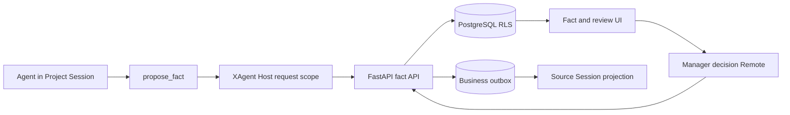

# XAgent Phase 4B Fact Proposal and Approval Design

English | [中文](2026-09-06-xagent-phase-4b-fact-approval-design.zh.md)

**Status:** Approved for implementation planning

**Date:** 2026-09-06

## 1. Goal and scope

Phase 4B adds the first governed business write to `xagent-business`: an agent in a Project Session proposes a typed project fact, an authorized manager reviews the immutable proposal later, and FastAPI confirms a new fact revision atomically. The proposal and decision survive browser, Host, and service restarts without duplicating the fact, audit, or Session projection.

This phase builds on [Phase 4A retrieval and citations](2026-08-28-xagent-phase-4a-rag-design.md). FastAPI and PostgreSQL remain the source of truth for business data, authorization, approval state, and audit. The existing DSH user-approval capability remains a one-operation decision inside a live Turn and does not become the business approval store.

The first vertical slice deliberately owns one business object. It does not build a generic approval platform before a second approved object type exists.

## 2. Confirmed product decisions

1. `propose_fact` is available only in Project Sessions. Private and cross-project Sessions remain read-only.
2. A specialist or manager with current project access may create a proposal.
3. A manager with current project access may approve or reject. A manager may approve their own proposal.
4. A proposal ends the current tool operation but does not block the Turn for a reviewer. Review is durable and may occur from another browser or after a restart.
5. Approval confirms the Fact revision in the same FastAPI transaction. Pure database confirmation has no asynchronous `executing` state.
6. Approval never starts an Agent Turn. The decision enters the source Session before its next model request and is otherwise visible through the Fact UI.
7. Proposal evidence is optional and accepts at most 64 distinct citation IDs. A proposal without citation evidence requires a non-empty assertion reason and remains visibly marked as having no artifact evidence.
8. Facts are typed project fields rather than arbitrary prose statements.
9. Optimistic revision comparison prevents a stale proposal from overwriting a newer confirmed value.
10. Namespace unification, document generation, exports, and external-system writes remain separate work.

## 3. Architecture and ownership



FastAPI owns proposal preparation and admission, confirmed Fact revisions and heads, evidence relations, decisions, conflict detection, idempotency, audit, and Outbox rows. PostgreSQL RLS and transaction-local actor context remain mandatory; application filtering does not replace them.

`@xagent/dsh-fact` is the request-scoped Service Provider and Browser Remote. It carries the authenticated Principal and user token supplied by the physical connection, performs strict protocol parsing, owns cancellation and disposal, and stores no business facts.

`@xagent/dsh-tool-fact` is the model-facing Consumer. It registers `propose_fact` only for an authenticated Project Session, sends a short-lived delegation and a tool-call-derived idempotency identity, and keeps the preparation receipt outside the public tool result until Session admission.

`@xagent/dsh-ui-fact` provides the Business-only Fact panel, proposal review actions, proposal Tool renderer, and evidence navigation. It reuses the existing workbench and artifact citation services rather than copying project or artifact access logic.

The existing `@deepseek-ai/dsh-user-approval` package remains unchanged. Its `approval/request` result authorizes one live operation and is not evidence that a durable business proposal was approved.

## 4. Fact and proposal data

### 4.1 Typed Fact value

The wire value is a closed tagged union:

```ts
type ProjectFactValue =
  | { readonly type: 'text'; readonly value: string }
  | { readonly type: 'number'; readonly value: number }
  | { readonly type: 'boolean'; readonly value: boolean }
  | { readonly type: 'date'; readonly value: string }
```

Dates use exact `YYYY-MM-DD`. Numbers must be finite JSON numbers. A text value is at most 16 KiB UTF-8; labels are at most 255 UTF-8 bytes; field keys are at most 128 ASCII bytes; assertion reasons, rejection reasons, and optional decision notes are each at most 4 KiB UTF-8. `field_key` matches `^[a-z0-9]+(?:[._-][a-z0-9]+)*$`; it is a stable identifier rather than a user-visible title.

### 4.2 PostgreSQL relations

`project_fact_revisions` stores immutable values keyed by Fact revision ID and includes project ID, field key, label, typed value, positive content revision, proposal ID, confirmer ID, and timestamps. `(project_id, field_key, content_revision)` is unique.

`project_fact_heads` contains one row per `(project_id, field_key)` and points to the current immutable revision. The head and referenced revision must name the same project and field key.

`fact_proposals` stores the immutable candidate, proposer, source Session, source tool call, server-derived base revision, status, decision actor, decision reason, payload hash, idempotency identity, and timestamps. The internal preparation state is not returned by ordinary proposal listings.

`fact_proposal_evidence` links a proposal to zero or more exact admitted citations from its source Session. Each row preserves citation ID, Artifact ID, Version ID, Index generation, Chunk ID, and line range through foreign keys to the durable admitted-evidence ledger. The relation never accepts a filename, object key, URL, or model-supplied artifact identity as authority.

`business_outbox` stores an immutable decision projection identified by an Outbox event ID, aggregate kind `fact_proposal`, aggregate ID, source Session ID, payload hash, creation time, and optional consumption identity. The first version admits no other aggregate kind.

Fact operation idempotency uses a dedicated relation or an equivalently closed extension of the existing XAgent idempotency store. Each entry binds actor, operation, idempotency key, canonical request hash, and exact response identity.

## 5. Proposal lifecycle

The internal preparation transition is:

```text
prepared -> pending
prepared -> expired
```

Only `pending` and terminal proposals appear in the product. The public transition table is:

```text
pending -> confirmed
pending -> rejected
pending -> withdrawn
pending -> conflicted
```

All terminal states are irreversible. A retry of the same operation and same canonical request returns the original result. Reusing the same key with different fields fails with `idempotency-conflict`.

The server derives `base_revision` while preparing the proposal. Approval locks the proposal and current Fact head. If the head still names `base_revision`, the transaction inserts the next immutable revision, switches the head, marks the proposal `confirmed`, writes the audit record, and inserts one Outbox row. If the head changed, the transaction marks the proposal `conflicted` and writes no Fact revision.

The proposer may withdraw their own `pending` proposal. A manager rejects a proposal with a required reason. Approval may include an optional decision note but cannot change the candidate value, label, evidence, assertion reason, base revision, or project.

The proposer losing access does not erase an admitted proposal. A decision requires an active manager who currently has access to the project. Evidence-backed approval also reauthorizes the immutable evidence for that manager. A failed authorization changes no proposal state.

## 6. Tool preparation and Session admission

The model tool accepts this closed input:

```ts
interface ProposeFactInput {
  readonly field_key: string
  readonly label: string
  readonly value: ProjectFactValue
  readonly evidence_ids?: readonly string[]
  readonly assertion_reason?: string
}
```

`project_id`, actor ID, Session ID, permission revision, tool call ID, base revision, and idempotency key are not model fields. Host derives them from the authenticated request and fixed Project Session.

The tool sends FastAPI a bounded request with the service credential, user token, and a fresh delegation bound to the exact actor, Session, project, tool call, tool name, permission revision, expiry, and nonce. FastAPI revalidates every field and current permission under RLS.

FastAPI first creates or replays an immutable `prepared` proposal with a five-minute admission deadline and returns a minimal public result plus an opaque admission receipt. The proposal is hidden from review queries at this point. Evidence IDs, when present, must resolve through the source Session's durable admitted-evidence relation and belong to its fixed project. When no evidence ID is present, a bounded non-empty assertion reason is required.

The matching public `tool/result` becomes authoritative only through the Session append transaction. Append validates the preparation receipt, tool call, public payload hash, Session, project, actor, and source event sequence, then changes the proposal to `pending` and consumes the receipt atomically. A cancelled, expired, malformed, or failed append exposes no reviewable proposal.

`propose_fact` does not conclude the Turn. If the same request used retrieval evidence, the existing structured cited-answer requirement still governs the Turn's final answer.

## 7. Review API and atomic confirmation

Browser calls use the generated Fact Remote through the authenticated Host connection and existing CSRF header provider. The Remote supports bounded project Fact and proposal lists, Fact/proposal detail, approve, reject, and withdraw. It accepts no actor, role, project ownership, permission revision, or evidence identity from Browser state.

An approval request contains only proposal ID, decision note, and a fresh operation idempotency key. A rejection additionally requires a bounded reason. FastAPI derives the project, candidate, current head, and reviewer from durable state.

Approval is one serializable transaction. It rechecks the login, active account, manager role, permission revision, project access, proposal state, evidence access, and Fact head before creating the new revision. Fact confirmation, head replacement, proposal status, audit, and Outbox insertion either all commit or all roll back.

Self-approval is valid. Concurrent identical decisions replay the first result. Concurrent different decisions produce one terminal result and one stable conflict without changing the winner.

## 8. Outbox and Session projection

The Fact UI reads current proposal and Fact state directly through FastAPI and does not wait for Session delivery. The Outbox exists to make the business decision part of the source Session's durable history without making FastAPI launch an Agent or depend on a live Host.

When an authorized user opens the source Session or before its next model request, the Fact provider pulls a bounded ordered page of unconsumed rows for that Session. It converts each row to the closed `fact/proposal-decided` Session event and appends it through ordinary Session persistence.

The remote append admission validates the Outbox ID, source Session, proposal, payload hash, and event identity, then marks the row consumed in the same transaction that accepts the Session event. If append committed but the response was lost, the exact append replay returns the original result and the Outbox remains consumed once. Cancellation before commit leaves the row available for another pull.

The decision event contains proposal ID, project field identity, terminal status, optional confirmed Fact revision identity, and the bounded human decision reason. It contains no fact evidence text, artifact URL, receipt, token, or secret. Its model projection is available only on a later user-initiated Turn; receiving the event never starts a Turn automatically.

Outbox order is creation order with a stable ID tie-break. Fact and proposal list requests return at most 100 rows per page; an Outbox pull returns at most 32 rows so memory and append size remain bounded. A malformed or unauthorized row fails closed and is not acknowledged.

## 9. Fact and review UI

The Business workbench adds a `facts` tab beside the existing overview and artifact tabs. `@xagent/dsh-ui-fact` occupies a dedicated workbench slot; the generic workbench keeps a stable empty behavior when no occupant is registered.

The Fact view shows current heads first and `pending` proposals in a separate review section. Specialists see proposal status. Managers with project access see approve and reject actions. A proposer sees withdraw while their proposal is still pending.

Fact detail shows the typed value, label, field key, revision history, proposer/confirmer attribution, evidence links, and assertion reason. Evidence-free proposals and confirmed revisions display a stable “No artifact evidence” status; the assertion reason never renders as an artifact citation.

Evidence links invoke the existing artifact citation opener with only the server-authorized Artifact, Version, Chunk, and line range. The opener reauthorizes and selects the immutable version exactly as it does for cited answers.

The `propose_fact` Tool card displays the server proposal ID and current status. It may refresh the status through the Fact Remote, but it never derives approval from model text or trusts tool arguments as durable state. Missing or revoked access displays an unavailable state without leaking the project, field, or reviewer.

Account, project, Session, and plugin changes cancel owned requests, clear prior scope state synchronously, and discard late results. Browser persistent storage contains no Fact cache, token, receipt, object key, signed URL, or assertion content.

## 10. Authorization and audit

Only the Business profile receives the Fact Provider, tool Consumer, Remote, and UI. Developer, ordinary Web, Headless, JiaxinAgent, Private Sessions, and Code Mode receive no Fact write schema or Fact UI row.

Proposal creation requires an active specialist or manager with current access to the fixed Session project. Decision requires an active manager with current access to that same project. Global manager role does not bypass project RLS. Guessing a proposal, Fact, Session, project, citation, or Outbox ID returns the same not-found result as absence.

Every protected request rechecks the login and permission revision. Account deactivation, login revocation, role change, project membership removal, or project loss affects the next request. No cached Browser or Host decision grants continuing authority.

Audit covers preparation, admission, expiry, withdrawal, approval, rejection, revision conflict, Fact confirmation, Outbox projection, replay, cancellation before commit, and authorization denial. Audit stores identities, operation hashes, stable outcomes, and latency; it does not store Fact text, assertion reasons, evidence text, tokens, receipts, URLs, or object keys.

## 11. Failures, cancellation, and recovery

Stable failures include invalid field input, missing assertion reason, invalid evidence, invalid Session scope, not found, stale permission, revision conflict, already decided, idempotency conflict, admission expiry, and service unavailable. Unknown backend or protocol responses map to service unavailable at the Host boundary.

Browser cancellation, Session cancellation, connection replacement, account/project change, and plugin disposal abort owned HTTP requests. Owners reject new work before cancellation and wait for in-flight work to settle. A transaction that committed before cancellation remains authoritative and is recovered by idempotent replay.

A prepared proposal that never reaches Session admission remains hidden and expires. A pending proposal survives every runtime restart. A decision transaction cannot leave an approved proposal without its Fact revision, head, audit, and Outbox row. An undelivered Outbox row remains pullable; a duplicate delivery cannot duplicate its Session event.

No generic automatic retry executes a business decision. Clients may retry only requests carrying their original idempotency key. A confirmed fact is changed only by another approved proposal creating a later revision.

## 12. Verification

Migration and PostgreSQL tests cover upgrade/downgrade/upgrade, closed status checks, immutable revision rows, one head per project field, positive contiguous revisions, evidence foreign keys, RLS, grants, worker denial, and Outbox uniqueness.

FastAPI tests cover preparation/admission, evidence-backed and evidence-free proposals, missing reasons, self-approval, project authorization, account and membership revocation, idempotent replay, conflicting decisions, optimistic revision conflicts, withdrawal, transaction rollback, Outbox replay, and audit redaction.

TypeScript tests cover strict backend decoding, delegation fields, request ownership, cancellation settlement, receipt secrecy, Project-only schema registration, the interaction with cited-answer policy, Session event projection, and inactive-profile absence.

Client tests cover pending and current lists, manager and specialist actions, evidence-free labeling, immutable citation navigation, conflicting proposals, account/project/Session replacement, keyboard operation, disabled duplicate submission, and late-result rejection.

A real Business Loader test verifies Host and Browser composition, generated Remote transport, exact Native schemas, Code Mode absence, and Developer/Web/Headless absence. A keyless replay scenario exercises the real Agent loop and Session admission. A built Browser e2e uses real FastAPI, PostgreSQL RLS, two accounts, project evidence, self-approval, a competing proposal, restart recovery, and exact Fact revision/UI replay. The demonstrated GUI flow produces a secret-clean GIF from the same reviewed revision.

Session-event changes update both TypeScript and Python SDK expected outputs. Documentation updates the root architecture, package READMEs and JSDoc, generated catalogs, Business composition, an active Agent Note, and a Phase 4B progress record.

## 13. Delivery and rollback

Implementation is split into independently reviewable migration/API, backend client and capability, tool admission, UI, profile composition, and assembled-acceptance commits. Each behavior begins with a failing test and reaches focused green before the next unit.

The database migration follows the current Phase 4A head and includes a tested downgrade for empty or disposable environments. Because the application remains pre-release, rollback of deployed business data uses a reviewed database backup rather than silently coercing Fact rows into an older format.

Removing the Business profile rows disables all new Host and Browser entry points without changing other profiles. It does not delete confirmed Facts, proposals, audits, or pending Outbox rows.

## 14. Explicit exclusions

- Generic multi-resource business approval abstractions.
- Document drafts, exports, Office/PDF generation, and external-system writes.
- Asynchronous approval execution workers and `approved -> executing` transitions.
- Automatic Agent wake-up or model response after a decision.
- Private or cross-project Session writes.
- Evidence-free proposals without an assertion reason.
- Manual Fact entry outside the Agent proposal flow.
- Fact extraction batches, deduplication by semantic similarity, and automatic conflict resolution.
- Namespace unification or public/private registry changes.
