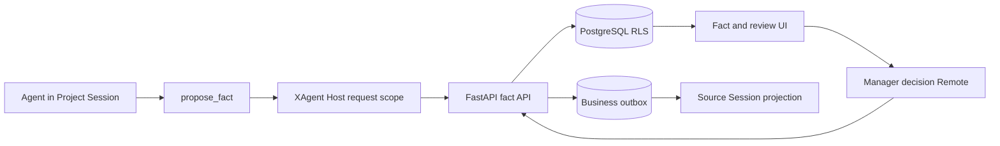

# XAgent Phase 4B 事实提案与审批设计

[English](2026-09-06-xagent-phase-4b-fact-approval-design.md) | 中文

**状态：** 已批准进入实施计划

**日期：** 2026-09-06

## 1. 目标与范围

Phase 4B 为 `xagent-business` 增加首个受治理的业务写操作：项目 Session 中的 agent（智能体）提议一项类型化项目事实，获授权的管理员稍后审核不可变提案，FastAPI 原子确认新的事实 revision。提案与决定跨 Browser、Host 和服务重启保留，且不会重复创建事实、审计或 Session 投影。

本阶段建立在 [Phase 4A 检索与引用](2026-08-28-xagent-phase-4a-rag-design.md)之上。FastAPI 与 PostgreSQL 继续作为业务数据、授权、审批状态和审计的真源。现有 DSH 用户审批能力仍只在活动 Turn 内决定一次操作，不成为业务审批存储。

首个垂直切片只拥有一种业务对象。在出现第二种已批准对象类型前，本阶段不建立通用审批平台。

## 2. 已确认产品决策

1. `propose_fact` 只在项目 Session 中可用。私人及跨项目 Session 保持只读。
2. 当前拥有项目访问权的专员或管理员可以创建提案。
3. 当前拥有项目访问权的管理员可以批准或驳回。管理员可以批准自己的提案。
4. 提案会结束当前工具操作，但不会阻塞 Turn 等待审核者。审核是持久的，可以从另一个 Browser 或在重启后完成。
5. 审批在同一个 FastAPI 事务中确认 Fact revision。纯数据库确认没有异步 `executing` 状态。
6. 审批不会启动 Agent Turn。决定会在来源 Session 的下一次模型请求前进入该 Session，也可以通过事实 UI 查看。
7. 提案证据可选。没有 citation 证据的提案必须包含非空依据说明，并始终明显标记为没有资料证据。
8. 事实采用类型化项目字段，而不是任意散文陈述。
9. 乐观 revision 比较阻止陈旧提案覆盖较新的已确认值。
10. 命名空间统一、文档生成、导出和外部系统写入仍是独立工作。

## 3. 架构与归属



FastAPI 拥有提案准备与入账、已确认 Fact revision 和 head、证据关系、决定、冲突检测、幂等、审计及 Outbox 行。PostgreSQL RLS 与事务本地 actor 上下文保持必选；应用层过滤不能替代它们。

`@xagent/dsh-fact` 是请求作用域的 Service Provider 和 Browser Remote。它携带物理连接提供的已认证 Principal 与用户 token，执行严格协议解析，拥有取消和 dispose（资源释放），并且不保存业务事实。

`@xagent/dsh-tool-fact` 是面向模型的 Consumer。它只为已认证项目 Session 注册 `propose_fact`，发送短期委托与从工具调用派生的幂等身份，并在 Session 入账前把准备收据保留在公开工具结果之外。

`@xagent/dsh-ui-fact` 提供 Business 专属事实面板、提案审核操作、提案工具渲染器和证据导航。它复用现有工作台和资料 citation 服务，不复制项目或资料访问逻辑。

现有 `@deepseek-ai/dsh-user-approval` 包保持不变。它的 `approval/request` 结果只授权一次活动操作，并不能证明某项持久业务提案已获批准。

## 4. 事实与提案数据

### 4.1 类型化事实值

协议值是关闭的带标签联合：

```ts
type ProjectFactValue =
  | { readonly type: 'text'; readonly value: string }
  | { readonly type: 'number'; readonly value: number }
  | { readonly type: 'boolean'; readonly value: boolean }
  | { readonly type: 'date'; readonly value: string }
```

日期采用精确 `YYYY-MM-DD`。数字必须是有限 JSON 数字。文本、标签、字段键和依据说明均有明确 UTF-8 字节上限。`field_key` 是由小写片段及 `.`、`_`、`-` 分隔符组成的稳定 ASCII 标识，不是面向用户的标题。

### 4.2 PostgreSQL 关系

`project_fact_revisions` 保存以 Fact revision ID 为键的不可变值，并包含项目 ID、字段键、标签、类型化值、正数内容 revision、提案 ID、确认者 ID 和时间。`(project_id, field_key, content_revision)` 唯一。

`project_fact_heads` 每个 `(project_id, field_key)` 保存一行，并指向当前不可变 revision。head 与被引用 revision 必须命名相同项目和字段键。

`fact_proposals` 保存不可变候选值、提案人、来源 Session、来源工具调用、服务端派生的基础 revision、状态、决定 actor、决定原因、payload hash、幂等身份和时间。普通提案列表不返回内部准备状态。

`fact_proposal_evidence` 把提案关联到其来源 Session 中零项或多项精确已入账 citation。每一行通过 durable admitted-evidence ledger 的外键保留 citation ID、Artifact ID、Version ID、Index generation、Chunk ID 和行范围。该关系绝不把文件名、对象 Key、URL 或模型提供的资料身份作为权限依据。

`business_outbox` 保存由 Outbox event ID 标识的不可变决定投影，包括 aggregate kind `fact_proposal`、aggregate ID、来源 Session ID、payload hash、创建时间和可选消费身份。首版不接受其他 aggregate kind。

事实操作幂等使用专用关系，或对现有 XAgent 幂等存储进行同等关闭的扩展。每个条目绑定 actor、操作、幂等键、规范请求 hash 和精确响应身份。

## 5. 提案生命周期

内部准备转换为：

```text
prepared -> pending
prepared -> expired
```

产品只显示 `pending` 和终态提案。公开状态转换表为：

```text
pending -> confirmed
pending -> rejected
pending -> withdrawn
pending -> conflicted
```

所有终态都不可逆。相同操作和相同规范请求的重试返回原结果。相同键用于不同字段时以 `idempotency-conflict` 失败。

服务端在准备提案时派生 `base_revision`。批准会锁定提案和当前 Fact head。如果 head 仍命名 `base_revision`，事务会插入下一条不可变 revision、切换 head、把提案标记为 `confirmed`、写入审计并插入一个 Outbox 行。如果 head 已变化，事务把提案标记为 `conflicted`，且不写 Fact revision。

提案人可以撤回自己的 `pending` 提案。管理员驳回提案时必须提供原因。批准可以附带可选决定说明，但不能修改候选值、标签、证据、依据说明、基础 revision 或项目。

提案人失去访问权不会清除已入账提案。决定必须由当前仍可访问该项目的活动管理员执行。有证据的审批还会按该管理员当前权限重新授权不可变证据。授权失败不会改变提案状态。

## 6. 工具准备与 Session 入账

模型工具接受以下关闭输入：

```ts
interface ProposeFactInput {
  readonly field_key: string
  readonly label: string
  readonly value: ProjectFactValue
  readonly evidence_ids?: readonly string[]
  readonly assertion_reason?: string
}
```

`project_id`、actor ID、Session ID、permission revision、工具调用 ID、基础 revision 和幂等键都不是模型字段。Host 从已认证请求和固定项目 Session 中派生这些值。

工具使用服务凭据、用户 token 和一份绑定精确 actor、Session、项目、工具调用、工具名称、permission revision、过期时间及 nonce 的新委托，向 FastAPI 发送有界请求。FastAPI 在 RLS 下重新验证每个字段和当前权限。

FastAPI 首先创建或重放一个不可变 `prepared` 提案，并返回最小公开结果和不透明入账收据。此时审核查询看不到该提案。证据 ID 存在时必须通过来源 Session 的持久 admitted-evidence 关系解析，并属于其固定项目。没有证据 ID 时必须提供有界非空依据说明。

匹配的公开 `tool/result` 只有经过 Session append 事务后才具权威性。append 校验准备收据、工具调用、公开 payload hash、Session、项目、actor 和来源事件 sequence，然后原子地把提案改为 `pending` 并消费收据。被取消、过期、畸形或失败的 append 不会暴露可审核提案。

`propose_fact` 不会结束 Turn。如果同一请求使用了检索证据，现有结构化引用终稿要求仍治理该 Turn 的最终回答。

## 7. 审核 API 与原子确认

Browser 调用通过已认证 Host 连接和现有 CSRF header provider 使用生成的 Fact Remote。Remote 支持有界的项目事实与提案列表、事实/提案详情、批准、驳回和撤回。它不接受 Browser 状态中的 actor、role、项目归属、permission revision 或证据身份。

批准请求只包含提案 ID、决定说明和新的操作幂等键。驳回还必须包含有界原因。FastAPI 从持久状态派生项目、候选值、当前 head 和审核者。

批准是一个 serializable 事务。它在创建新 revision 前重新检查登录、活动账号、管理员角色、permission revision、项目访问权、提案状态、证据访问权和 Fact head。事实确认、head 替换、提案状态、审计和 Outbox 插入要么全部提交，要么全部回滚。

允许自我审批。并发的相同决定重放首个结果；并发的不同决定只有一个终态结果，另一项返回稳定冲突且不修改胜出结果。

## 8. Outbox 与 Session 投影

事实 UI 通过 FastAPI 直接读取当前提案和 Fact 状态，不等待 Session 交付。Outbox 用于把业务决定纳入来源 Session 的持久历史，同时不让 FastAPI 启动 Agent 或依赖活动 Host。

获授权用户打开来源 Session 时，或该 Session 的下一次模型请求前，事实提供方会拉取该 Session 未消费行的有界有序页面。它把每一行转换为关闭的 `fact/proposal-decided` Session 事件，并通过普通 Session persistence append。

远端 append admission 校验 Outbox ID、来源 Session、提案、payload hash 和事件身份，然后在接受 Session event 的同一事务中把该行标记为已消费。如果 append 已提交但响应丢失，精确 append 重放会返回原结果，且 Outbox 仍只消费一次。提交前取消会让该行可供再次拉取。

决定事件包含提案 ID、项目字段身份、终态状态、可选已确认 Fact revision 身份和有界人工决定原因。它不包含事实证据正文、资料 URL、收据、token 或 secret。它的模型投影只在之后由用户发起的 Turn 中可用；收到事件绝不会自动启动 Turn。

Outbox 按创建顺序排序，并以稳定 ID 处理相同时间。页面上限限制内存和 append 大小。畸形或未授权行会失败关闭且不会被确认。

## 9. 事实与审核 UI

Business 工作台在现有概览和资料页签旁增加 `facts` 页签。`@xagent/dsh-ui-fact` 占用一个专用工作台 slot；没有 occupant 时，通用工作台保持稳定空行为。

事实视图首先显示当前 head，并在独立审核区显示 `pending` 提案。专员可以查看提案状态。拥有项目访问权的管理员可以批准和驳回。提案人在自己的提案仍为 pending 时可以撤回。

事实详情显示类型化值、标签、字段键、revision 历史、提案人/确认者归因、证据链接和依据说明。没有证据的提案与已确认 revision 显示稳定的“无资料证据”状态；依据说明绝不渲染成资料 citation。

证据链接只使用服务端授权的 Artifact、Version、Chunk 和行范围调用现有资料 citation opener。该 opener 按已引用回答相同的方式重新授权并精确选择不可变版本。

`propose_fact` 工具卡片显示服务端提案 ID 和当前状态。它可以通过 Fact Remote 刷新状态，但绝不从模型文本派生审批，也不把工具参数当作持久状态。访问缺失或已撤销时显示不可用状态，不泄露项目、字段或审核者。

账号、项目、Session 和插件变化会取消所属请求、同步清除先前作用域状态，并丢弃迟到结果。Browser 持久存储不包含 Fact 缓存、token、收据、对象 Key、签名 URL 或依据内容。

## 10. 授权与审计

只有 Business Profile 获得事实 Provider、工具 Consumer、Remote 和 UI。Developer、普通 Web、Headless、JiaxinAgent、私人 Session 和 Code Mode 不获得事实写 schema 或事实 UI 配置项。

创建提案要求活动专员或管理员当前可访问固定 Session 项目。决定要求活动管理员当前可访问同一项目。全局管理员角色不能绕过项目 RLS。猜测提案、Fact、Session、项目、citation 或 Outbox ID 时，与对象不存在返回相同 not-found 结果。

每个受保护请求都重新检查登录和 permission revision。账号停用、登录撤销、角色变化、项目成员移除或项目失权会影响下一个请求。Browser 或 Host 的缓存决定都不能授予持续权限。

审计覆盖准备、入账、过期、撤回、批准、驳回、revision 冲突、事实确认、Outbox 投影、重放、提交前取消和授权拒绝。审计保存身份、操作 hash、稳定结果和时延；不保存事实文本、依据说明、证据正文、token、收据、URL 或对象 Key。

## 11. 失败、取消与恢复

稳定失败包括字段输入无效、缺少依据说明、证据无效、Session 作用域无效、not found、权限陈旧、revision 冲突、已经决定、幂等冲突、入账过期和服务不可用。未知后端或协议响应在 Host 边界映射为服务不可用。

Browser 取消、Session 取消、连接替换、账号/项目变化和插件 dispose 会中止所属 HTTP 请求。所有者会先拒绝新工作，再取消并等待在途工作结算。取消前已提交的事务保持权威，并通过幂等重放恢复。

从未到达 Session admission 的 prepared 提案保持隐藏并过期。pending 提案跨所有运行时重启保留。决定事务不能留下缺少 Fact revision、head、审计或 Outbox 行的已批准提案。未交付 Outbox 行保持可拉取；重复交付不能重复其 Session event。

通用自动重试不得执行业务决定。客户端只能使用原始幂等键重试请求。已确认事实只能由另一个获批准提案创建更晚 revision 来改变。

## 12. 验证

Migration 与 PostgreSQL 测试覆盖 upgrade/downgrade/upgrade、关闭状态检查、不可变 revision 行、每个项目字段唯一 head、正数连续 revision、证据外键、RLS、grant、worker 拒绝和 Outbox 唯一性。

FastAPI 测试覆盖准备/入账、有证据和无证据提案、缺失依据、自我审批、项目授权、账号及成员撤权、幂等重放、冲突决定、乐观 revision 冲突、撤回、事务回滚、Outbox 重放和审计脱敏。

TypeScript 测试覆盖严格后端解码、委托字段、请求归属、取消结算、收据保密、仅项目 schema 注册、与 cited-answer policy 的交互、Session event 投影和非活动 Profile 缺席。

Client 测试覆盖 pending 和当前列表、管理员与专员操作、无证据标记、不可变 citation 导航、冲突提案、账号/项目/Session 替换、键盘操作、禁止重复提交和迟到结果丢弃。

真实 Business Loader 测试验证 Host 与 Browser 组合、生成 Remote transport、精确 Native schema、Code Mode 缺席和 Developer/Web/Headless 缺席。无密钥 replay 场景运行真实 agent loop 与 Session admission。构建版 Browser e2e 使用真实 FastAPI、PostgreSQL RLS、两个账号、项目证据、自我审批、竞争提案、重启恢复及精确 Fact revision/UI replay。演示 GUI 流从同一个已审查 revision 生成不含 secret 的 GIF。

Session event 变化同步更新 TypeScript 与 Python SDK 预期输出。文档更新根架构、包 README 与 JSDoc、生成目录、Business 组合、一项 active Agent Note 和一份 Phase 4B 进度记录。

## 13. 交付与回滚

实现拆分为可独立审查的 migration/API、backend client 与能力、工具 admission、UI、Profile 组合及组装验收提交。每项行为先有失败测试，再达到 focused green，之后才进入下一个单元。

数据库 migration 跟随当前 Phase 4A head，并为全新或一次性环境提供已测试 downgrade。由于应用仍处于预发布状态，已部署业务数据的回滚使用经审核的数据库备份，而不是静默地把 Fact 行强制转换为旧格式。

移除 Business Profile 配置项会禁用所有新的 Host 和 Browser 入口，且不改变其他 Profile。该操作不会删除已确认 Fact、提案、审计或 pending Outbox 行。

## 14. 明确排除项

- 通用多资源业务审批抽象。
- 文档草稿、导出、Office/PDF 生成和外部系统写入。
- 异步审批执行 worker 与 `approved -> executing` 转换。
- 决定后的自动 Agent 唤醒或模型回复。
- 私人或跨项目 Session 写入。
- 没有依据说明的无证据提案。
- Agent 提案流程之外的人工事实录入。
- 事实提取批处理、基于语义相似度的去重和自动冲突解决。
- 命名空间统一或公共/私有 registry 变化。
